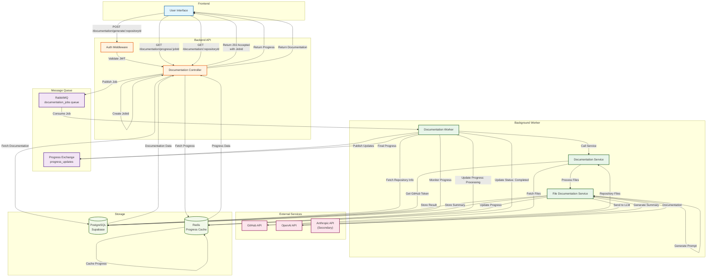
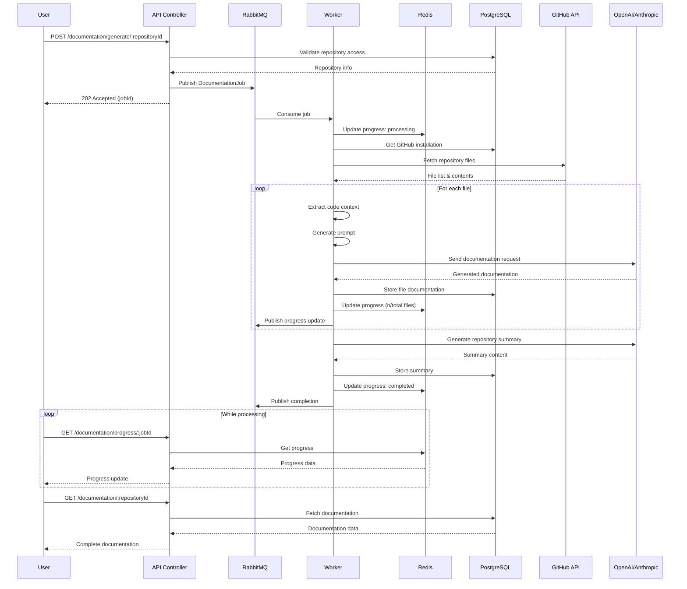

# Documentation Generation Flow

This document illustrates the complete request flow and queueing patterns for fetching code from GitHub, analyzing it with LLMs, and storing results in the database.

## Architecture Overview

The system uses an asynchronous, queue-based architecture to handle long-running documentation generation tasks. This ensures the API remains responsive while processing potentially large repositories.

## Flow Diagram



## Sequence Diagram



## Key Components

### 1. Documentation Controller
- **Location**: `/modules/documentation/controllers/documentation-controller.ts`
- **Responsibilities**:
  - Authenticate requests
  - Create job IDs
  - Publish jobs to queue
  - Return 202 Accepted for async operations
  - Serve progress and final results

### 2. Queue Service
- **Location**: `/services/queueService.ts`
- **Technology**: RabbitMQ
- **Queues**:
  - `documentation_jobs`: Main job queue with priority support
  - `progress_updates`: Topic exchange for real-time updates
- **Features**:
  - Durable queues for reliability
  - Priority queuing (max priority: 10)
  - Dead letter queue for failed jobs

### 3. Documentation Worker
- **Location**: `/workers/documentationWorker.ts`
- **Responsibilities**:
  - Consume jobs from queue
  - Orchestrate documentation generation
  - Update progress in Redis
  - Handle errors and retries
  - Graceful shutdown handling

### 4. Documentation Service
- **Location**: `/modules/documentation/services/documentation-service.ts`
- **Features**:
  - File-based documentation generation
  - Repository context extraction
  - Progress callbacks
  - Error handling with partial success

### 5. File Documentation Service
- **Location**: `/services/file-documentation.service.ts`
- **Processing Strategy**:
  - Individual file processing
  - Smart context extraction
  - Project type detection
  - Batch processing support
  - Repository summary generation

### 6. LLM Integration
- **Primary**: OpenAI Service
- **Secondary**: Anthropic Service (fallback)
- **Features**:
  - Rate limiting with exponential backoff
  - Token tracking and cost calculation
  - Request queuing
  - Configurable models

### 7. Progress Tracking
- **Technology**: Redis
- **TTL**: 1 hour per job
- **Data Structure**:
  ```json
  {
    "jobId": "uuid",
    "status": "processing",
    "currentFile": 15,
    "totalFiles": 50,
    "error": null,
    "completedAt": null
  }
  ```

## Error Handling

### Retry Mechanism
1. **File Level**: Each file is retried up to 3 times
2. **Partial Success**: Documentation saved even if some files fail
3. **Error Tracking**: Detailed errors stored in `documentation_generations` table

### Failure Scenarios
- **GitHub API Failure**: Job marked as failed, error stored
- **LLM API Failure**: Individual file retry, fallback to secondary LLM
- **Worker Crash**: Job remains in queue, picked up by another worker
- **Database Failure**: Job marked as failed, user notified

## Performance Optimizations

### 1. Smart Chunking
- Groups related files together
- Respects token limits
- Prioritizes important files

### 2. Caching
- GitHub API responses cached in Redis
- Repository metadata cached
- Progress data cached with TTL

### 3. Parallel Processing
- Multiple workers can process different repositories
- File processing can be parallelized within limits
- Progress updates are non-blocking

### 4. Connection Pooling
- Database connection pooling
- HTTP keep-alive for API calls
- RabbitMQ channel reuse

## Monitoring Points

1. **Queue Depth**: Monitor `documentation_jobs` queue size
2. **Processing Time**: Track job completion times
3. **Error Rate**: Monitor failed jobs and retries
4. **API Usage**: Track LLM token usage and costs
5. **Worker Health**: Monitor worker memory and CPU usage

## Security Considerations

1. **Authentication**: JWT validation on all endpoints
2. **Authorization**: Row-level security in PostgreSQL
3. **Token Storage**: GitHub tokens encrypted at rest
4. **Input Validation**: File paths and content sanitized
5. **Rate Limiting**: API and LLM request throttling

## Scalability

The architecture supports horizontal scaling at multiple levels:

1. **API Servers**: Stateless, can be load balanced
2. **Workers**: Multiple workers can process jobs concurrently
3. **Queue**: RabbitMQ can be clustered
4. **Database**: Supabase handles scaling
5. **Cache**: Redis can be clustered

## Future Enhancements

1. **Webhook Support**: Real-time updates via webhooks
2. **Incremental Updates**: Only process changed files
3. **Multi-LLM Strategy**: Intelligent routing between providers
4. **Custom Prompts**: User-defined documentation templates
5. **Batch Operations**: Process multiple repositories in one job