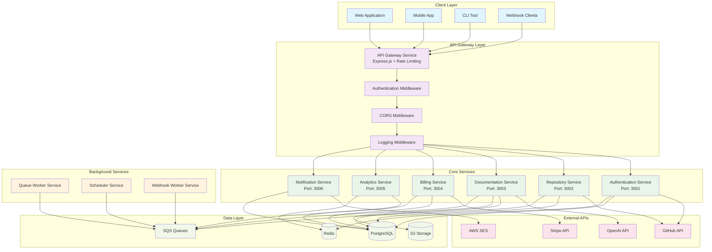

# API Architecture and Microservices Design

## Overview

The Lexicode SaaS platform follows a microservices architecture with a unified API gateway. Each service is responsible for a specific domain and communicates through well-defined APIs. The architecture prioritizes simplicity, maintainability, and scalability.

## Service Architecture



## API Gateway Service

The API Gateway serves as the single entry point for all client requests, handling authentication, rate limiting, and request routing.

### Core Features
- **Request Routing**: Route requests to appropriate microservices
- **Authentication**: JWT token validation and user context
- **Rate Limiting**: Per-user and per-endpoint rate limiting
- **CORS Handling**: Cross-origin resource sharing configuration
- **Request/Response Logging**: Structured logging for all API calls
- **Error Handling**: Centralized error handling and formatting

### Implementation

```typescript
// src/api-gateway/server.ts
import express from 'express';
import cors from 'cors';
import helmet from 'helmet';
import rateLimit from 'express-rate-limit';
import { createProxyMiddleware } from 'http-proxy-middleware';
import { authMiddleware } from './middleware/auth';
import { loggingMiddleware } from './middleware/logging';
import { errorHandler } from './middleware/error-handler';

const app = express();

// Security middleware
app.use(helmet());
app.use(cors({
  origin: process.env.ALLOWED_ORIGINS?.split(',') || ['http://localhost:3000'],
  credentials: true
}));

// Rate limiting
const limiter = rateLimit({
  windowMs: 15 * 60 * 1000, // 15 minutes
  max: 100, // limit each IP to 100 requests per windowMs
  message: 'Too many requests from this IP'
});
app.use('/api/', limiter);

// Middleware
app.use(express.json({ limit: '10mb' }));
app.use(loggingMiddleware);
app.use('/api/', authMiddleware);

// Health check
app.get('/health', (req, res) => {
  res.json({ status: 'OK', timestamp: new Date().toISOString() });
});

// Service proxies
const services = {
  auth: 'http://auth-service:3001',
  repositories: 'http://repo-service:3002',
  documentation: 'http://doc-service:3003',
  billing: 'http://billing-service:3004',
  analytics: 'http://analytics-service:3005',
  notifications: 'http://notify-service:3006'
};

// Create proxy middleware for each service
Object.entries(services).forEach(([service, target]) => {
  app.use(
    `/api/${service}`,
    createProxyMiddleware({
      target,
      changeOrigin: true,
      pathRewrite: {
        [`^/api/${service}`]: ''
      },
      onError: (err, req, res) => {
        console.error(`Proxy error for ${service}:`, err);
        res.status(502).json({ error: 'Service temporarily unavailable' });
      }
    })
  );
});

// Error handling
app.use(errorHandler);

const PORT = process.env.PORT || 3000;
app.listen(PORT, () => {
  console.log(`API Gateway running on port ${PORT}`);
});
```

## Microservices Design

### 1. Authentication Service (Port: 3001)

**Responsibilities:**
- User registration and login
- GitHub OAuth integration
- JWT token management
- Session management

**API Endpoints:**
```
POST /register
POST /login
POST /logout
GET /me
POST /github/oauth
POST /github/callback
POST /refresh-token
PUT /profile
DELETE /account
```

**Implementation:**
```typescript
// src/auth-service/routes/auth.ts
import { Router } from 'express';
import { AuthController } from '../controllers/auth-controller';
import { validateRequest } from '../middleware/validation';
import { loginSchema, registerSchema } from '../schemas/auth-schemas';

const router = Router();
const authController = new AuthController();

router.post('/register', validateRequest(registerSchema), authController.register);
router.post('/login', validateRequest(loginSchema), authController.login);
router.post('/logout', authController.logout);
router.get('/me', authController.getCurrentUser);
router.post('/github/oauth', authController.initiateGitHubOAuth);
router.post('/github/callback', authController.handleGitHubCallback);
router.post('/refresh-token', authController.refreshToken);
router.put('/profile', authController.updateProfile);
router.delete('/account', authController.deleteAccount);

export default router;
```

### 2. Repository Service (Port: 3002)

**Responsibilities:**
- GitHub repository management
- Repository synchronization
- Branch and file management
- Webhook handling

**API Endpoints:**
```
GET /repositories
POST /repositories/sync
GET /repositories/:id
PUT /repositories/:id
DELETE /repositories/:id
GET /repositories/:id/branches
GET /repositories/:id/files
POST /repositories/:id/webhook
```

**Implementation:**
```typescript
// src/repo-service/controllers/repository-controller.ts
import { Request, Response } from 'express';
import { RepositoryService } from '../services/repository-service';
import { GitHubService } from '../services/github-service';

export class RepositoryController {
  private repositoryService = new RepositoryService();
  private githubService = new GitHubService();

  async getRepositories(req: Request, res: Response) {
    try {
      const userId = req.user.id;
      const repositories = await this.repositoryService.getUserRepositories(userId);
      res.json(repositories);
    } catch (error) {
      res.status(500).json({ error: 'Failed to fetch repositories' });
    }
  }

  async syncRepositories(req: Request, res: Response) {
    try {
      const userId = req.user.id;
      const repositories = await this.githubService.syncUserRepositories(userId);
      res.json(repositories);
    } catch (error) {
      res.status(500).json({ error: 'Failed to sync repositories' });
    }
  }

  async getRepository(req: Request, res: Response) {
    try {
      const { id } = req.params;
      const repository = await this.repositoryService.getRepository(id);
      res.json(repository);
    } catch (error) {
      res.status(404).json({ error: 'Repository not found' });
    }
  }
}
```

### 3. Documentation Service (Port: 3003)

**Responsibilities:**
- AI-powered documentation generation
- File processing and analysis
- Documentation storage and retrieval
- Progress tracking

**API Endpoints:**
```
POST /generate
GET /projects
GET /projects/:id
PUT /projects/:id
DELETE /projects/:id
GET /projects/:id/files
GET /projects/:id/generations
POST /projects/:id/regenerate
GET /projects/:id/download
```

**Implementation:**
```typescript
// src/doc-service/controllers/documentation-controller.ts
import { Request, Response } from 'express';
import { DocumentationService } from '../services/documentation-service';
import { QueueService } from '../services/queue-service';

export class DocumentationController {
  private documentationService = new DocumentationService();
  private queueService = new QueueService();

  async generateDocumentation(req: Request, res: Response) {
    try {
      const { repositoryId, branch, config } = req.body;
      const userId = req.user.id;

      const project = await this.documentationService.createProject({
        repositoryId,
        userId,
        branch,
        config
      });

      // Queue the documentation generation job
      await this.queueService.addJob('documentation-generation', {
        projectId: project.id,
        userId,
        repositoryId,
        branch,
        config
      });

      res.json({ projectId: project.id, status: 'queued' });
    } catch (error) {
      res.status(500).json({ error: 'Failed to queue documentation generation' });
    }
  }

  async getProjects(req: Request, res: Response) {
    try {
      const userId = req.user.id;
      const projects = await this.documentationService.getUserProjects(userId);
      res.json(projects);
    } catch (error) {
      res.status(500).json({ error: 'Failed to fetch projects' });
    }
  }
}
```

### 4. Billing Service (Port: 3004)

**Responsibilities:**
- Stripe integration
- Subscription management
- Usage tracking
- Invoice generation

**API Endpoints:**
```
GET /subscriptions
POST /subscriptions
PUT /subscriptions/:id
DELETE /subscriptions/:id
GET /usage
POST /webhooks/stripe
GET /invoices
POST /payment-methods
```

### 5. Analytics Service (Port: 3005)

**Responsibilities:**
- Usage metrics collection
- Dashboard data aggregation
- Reporting and insights
- Performance monitoring

**API Endpoints:**
```
GET /dashboard
GET /metrics
GET /reports
POST /events
GET /insights
```

### 6. Notification Service (Port: 3006)

**Responsibilities:**
- Email notifications
- Webhook deliveries
- Real-time updates
- Notification preferences

**API Endpoints:**
```
POST /send-email
POST /send-webhook
GET /notifications
PUT /preferences
```

## Inter-Service Communication

### Synchronous Communication
Services communicate synchronously through HTTP APIs for immediate responses.

```typescript
// src/shared/services/service-client.ts
import axios, { AxiosInstance } from 'axios';

export class ServiceClient {
  private client: AxiosInstance;

  constructor(baseURL: string) {
    this.client = axios.create({
      baseURL,
      timeout: 5000,
      headers: {
        'Content-Type': 'application/json'
      }
    });
  }

  async get(endpoint: string, params?: any) {
    const response = await this.client.get(endpoint, { params });
    return response.data;
  }

  async post(endpoint: string, data: any) {
    const response = await this.client.post(endpoint, data);
    return response.data;
  }
}
```

### Asynchronous Communication
Services use SQS for asynchronous communication and background processing.

```typescript
// src/shared/services/queue-service.ts
import { SQS } from 'aws-sdk';

export class QueueService {
  private sqs: SQS;

  constructor() {
    this.sqs = new SQS({
      region: process.env.AWS_REGION
    });
  }

  async addJob(queueName: string, jobData: any) {
    const queueUrl = `${process.env.SQS_BASE_URL}/${queueName}`;
    
    await this.sqs.sendMessage({
      QueueUrl: queueUrl,
      MessageBody: JSON.stringify(jobData),
      MessageAttributes: {
        jobType: {
          DataType: 'String',
          StringValue: queueName
        }
      }
    }).promise();
  }

  async processMessages(queueName: string, handler: (message: any) => Promise<void>) {
    const queueUrl = `${process.env.SQS_BASE_URL}/${queueName}`;
    
    while (true) {
      const result = await this.sqs.receiveMessage({
        QueueUrl: queueUrl,
        MaxNumberOfMessages: 10,
        WaitTimeSeconds: 20
      }).promise();

      if (result.Messages) {
        for (const message of result.Messages) {
          try {
            const jobData = JSON.parse(message.Body || '{}');
            await handler(jobData);
            
            // Delete message after successful processing
            await this.sqs.deleteMessage({
              QueueUrl: queueUrl,
              ReceiptHandle: message.ReceiptHandle!
            }).promise();
          } catch (error) {
            console.error('Error processing message:', error);
          }
        }
      }
    }
  }
}
```

## Error Handling and Resilience

### Circuit Breaker Pattern
```typescript
// src/shared/patterns/circuit-breaker.ts
export class CircuitBreaker {
  private failureCount = 0;
  private lastFailureTime = 0;
  private state: 'CLOSED' | 'OPEN' | 'HALF_OPEN' = 'CLOSED';

  constructor(
    private failureThreshold: number,
    private recoveryTimeout: number
  ) {}

  async execute<T>(operation: () => Promise<T>): Promise<T> {
    if (this.state === 'OPEN') {
      if (Date.now() - this.lastFailureTime > this.recoveryTimeout) {
        this.state = 'HALF_OPEN';
      } else {
        throw new Error('Circuit breaker is OPEN');
      }
    }

    try {
      const result = await operation();
      this.onSuccess();
      return result;
    } catch (error) {
      this.onFailure();
      throw error;
    }
  }

  private onSuccess() {
    this.failureCount = 0;
    this.state = 'CLOSED';
  }

  private onFailure() {
    this.failureCount++;
    this.lastFailureTime = Date.now();
    
    if (this.failureCount >= this.failureThreshold) {
      this.state = 'OPEN';
    }
  }
}
```

### Retry Logic
```typescript
// src/shared/patterns/retry.ts
export async function withRetry<T>(
  operation: () => Promise<T>,
  maxRetries: number = 3,
  backoffMs: number = 1000
): Promise<T> {
  let lastError: Error;

  for (let i = 0; i <= maxRetries; i++) {
    try {
      return await operation();
    } catch (error) {
      lastError = error as Error;
      
      if (i === maxRetries) {
        throw lastError;
      }

      const delay = backoffMs * Math.pow(2, i);
      await new Promise(resolve => setTimeout(resolve, delay));
    }
  }

  throw lastError!;
}
```

## API Documentation

### OpenAPI Specification
Each service includes comprehensive OpenAPI documentation:

```yaml
# src/auth-service/openapi.yaml
openapi: 3.0.0
info:
  title: Authentication Service API
  version: 1.0.0
  description: User authentication and authorization service

paths:
  /register:
    post:
      summary: Register a new user
      requestBody:
        required: true
        content:
          application/json:
            schema:
              type: object
              properties:
                email:
                  type: string
                  format: email
                password:
                  type: string
                  minLength: 8
                fullName:
                  type: string
              required:
                - email
                - password
      responses:
        '201':
          description: User registered successfully
          content:
            application/json:
              schema:
                type: object
                properties:
                  user:
                    $ref: '#/components/schemas/User'
                  token:
                    type: string
        '400':
          description: Invalid request data
        '409':
          description: User already exists

components:
  schemas:
    User:
      type: object
      properties:
        id:
          type: string
          format: uuid
        email:
          type: string
          format: email
        fullName:
          type: string
        createdAt:
          type: string
          format: date-time
```

## Testing Strategy

### Unit Tests
Each service includes comprehensive unit tests:

```typescript
// src/auth-service/tests/auth-controller.test.ts
import { AuthController } from '../controllers/auth-controller';
import { AuthService } from '../services/auth-service';

jest.mock('../services/auth-service');

describe('AuthController', () => {
  let authController: AuthController;
  let authService: jest.Mocked<AuthService>;

  beforeEach(() => {
    authService = new AuthService() as jest.Mocked<AuthService>;
    authController = new AuthController();
  });

  describe('register', () => {
    it('should register a new user successfully', async () => {
      const mockUser = {
        id: '123',
        email: 'test@example.com',
        fullName: 'Test User'
      };

      authService.register.mockResolvedValue(mockUser);

      const req = {
        body: {
          email: 'test@example.com',
          password: 'password123',
          fullName: 'Test User'
        }
      };

      const res = {
        status: jest.fn().mockReturnThis(),
        json: jest.fn()
      };

      await authController.register(req as any, res as any);

      expect(authService.register).toHaveBeenCalledWith({
        email: 'test@example.com',
        password: 'password123',
        fullName: 'Test User'
      });

      expect(res.status).toHaveBeenCalledWith(201);
      expect(res.json).toHaveBeenCalledWith({
        user: mockUser,
        token: expect.any(String)
      });
    });
  });
});
```

### Integration Tests
```typescript
// src/auth-service/tests/integration/auth.test.ts
import request from 'supertest';
import { app } from '../../app';
import { setupTestDatabase, teardownTestDatabase } from '../utils/test-db';

describe('Auth Integration Tests', () => {
  beforeAll(async () => {
    await setupTestDatabase();
  });

  afterAll(async () => {
    await teardownTestDatabase();
  });

  describe('POST /register', () => {
    it('should register a new user', async () => {
      const response = await request(app)
        .post('/register')
        .send({
          email: 'test@example.com',
          password: 'password123',
          fullName: 'Test User'
        });

      expect(response.status).toBe(201);
      expect(response.body).toHaveProperty('user');
      expect(response.body).toHaveProperty('token');
      expect(response.body.user.email).toBe('test@example.com');
    });
  });
});
```

## Monitoring and Observability

### Health Checks
```typescript
// src/shared/middleware/health-check.ts
import { Request, Response } from 'express';

export const healthCheck = async (req: Request, res: Response) => {
  const checks = {
    database: await checkDatabase(),
    redis: await checkRedis(),
    external_apis: await checkExternalAPIs()
  };

  const isHealthy = Object.values(checks).every(check => check.status === 'OK');

  res.status(isHealthy ? 200 : 503).json({
    status: isHealthy ? 'OK' : 'UNHEALTHY',
    timestamp: new Date().toISOString(),
    checks
  });
};
```

### Metrics Collection
```typescript
// src/shared/middleware/metrics.ts
import { Request, Response, NextFunction } from 'express';
import { Counter, Histogram } from 'prom-client';

const requestCounter = new Counter({
  name: 'http_requests_total',
  help: 'Total number of HTTP requests',
  labelNames: ['method', 'route', 'status_code']
});

const requestDuration = new Histogram({
  name: 'http_request_duration_seconds',
  help: 'Duration of HTTP requests in seconds',
  labelNames: ['method', 'route']
});

export const metricsMiddleware = (req: Request, res: Response, next: NextFunction) => {
  const startTime = Date.now();

  res.on('finish', () => {
    const duration = (Date.now() - startTime) / 1000;
    
    requestCounter.labels(req.method, req.route?.path || req.path, res.statusCode.toString()).inc();
    requestDuration.labels(req.method, req.route?.path || req.path).observe(duration);
  });

  next();
};
```

This comprehensive API architecture provides a solid foundation for building a scalable, maintainable SaaS platform with proper separation of concerns and robust error handling.