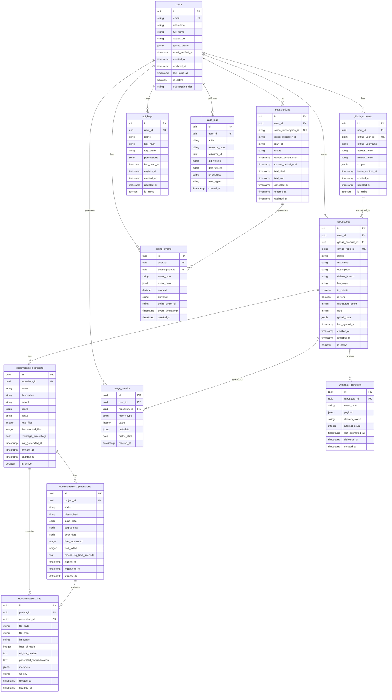

# Database Schema Design

## Overview

The Lexicode SaaS platform uses PostgreSQL as the primary database. The schema is designed to support user management, GitHub integration, documentation generation, billing, and analytics. The design follows normalization principles while optimizing for common query patterns.

## Database Schema Diagram



## Table Definitions

### Core User Management

```sql
-- Users table
CREATE TABLE users (
    id UUID PRIMARY KEY DEFAULT gen_random_uuid(),
    email VARCHAR(255) UNIQUE NOT NULL,
    username VARCHAR(100),
    full_name VARCHAR(255),
    avatar_url TEXT,
    github_profile JSONB,
    email_verified_at TIMESTAMP,
    created_at TIMESTAMP DEFAULT CURRENT_TIMESTAMP,
    updated_at TIMESTAMP DEFAULT CURRENT_TIMESTAMP,
    last_login_at TIMESTAMP,
    is_active BOOLEAN DEFAULT true,
    subscription_tier VARCHAR(50) DEFAULT 'free'
);

-- GitHub accounts table
CREATE TABLE github_accounts (
    id UUID PRIMARY KEY DEFAULT gen_random_uuid(),
    user_id UUID NOT NULL REFERENCES users(id) ON DELETE CASCADE,
    github_user_id BIGINT UNIQUE NOT NULL,
    github_username VARCHAR(100) NOT NULL,
    access_token TEXT NOT NULL,
    refresh_token TEXT,
    scopes JSONB NOT NULL DEFAULT '[]',
    token_expires_at TIMESTAMP,
    created_at TIMESTAMP DEFAULT CURRENT_TIMESTAMP,
    updated_at TIMESTAMP DEFAULT CURRENT_TIMESTAMP,
    is_active BOOLEAN DEFAULT true
);

-- Repositories table
CREATE TABLE repositories (
    id UUID PRIMARY KEY DEFAULT gen_random_uuid(),
    user_id UUID NOT NULL REFERENCES users(id) ON DELETE CASCADE,
    github_account_id UUID NOT NULL REFERENCES github_accounts(id) ON DELETE CASCADE,
    github_repo_id BIGINT UNIQUE NOT NULL,
    name VARCHAR(255) NOT NULL,
    full_name VARCHAR(255) NOT NULL,
    description TEXT,
    default_branch VARCHAR(100) DEFAULT 'main',
    language VARCHAR(50),
    is_private BOOLEAN DEFAULT false,
    is_fork BOOLEAN DEFAULT false,
    stargazers_count INTEGER DEFAULT 0,
    size INTEGER DEFAULT 0,
    github_data JSONB,
    last_synced_at TIMESTAMP,
    created_at TIMESTAMP DEFAULT CURRENT_TIMESTAMP,
    updated_at TIMESTAMP DEFAULT CURRENT_TIMESTAMP,
    is_active BOOLEAN DEFAULT true
);
```

### Documentation Management

```sql
-- Documentation projects table
CREATE TABLE documentation_projects (
    id UUID PRIMARY KEY DEFAULT gen_random_uuid(),
    repository_id UUID NOT NULL REFERENCES repositories(id) ON DELETE CASCADE,
    name VARCHAR(255) NOT NULL,
    description TEXT,
    branch VARCHAR(100) DEFAULT 'main',
    config JSONB DEFAULT '{}',
    status VARCHAR(50) DEFAULT 'active',
    total_files INTEGER DEFAULT 0,
    documented_files INTEGER DEFAULT 0,
    coverage_percentage DECIMAL(5,2) DEFAULT 0.00,
    last_generated_at TIMESTAMP,
    created_at TIMESTAMP DEFAULT CURRENT_TIMESTAMP,
    updated_at TIMESTAMP DEFAULT CURRENT_TIMESTAMP,
    is_active BOOLEAN DEFAULT true
);

-- Documentation generations table
CREATE TABLE documentation_generations (
    id UUID PRIMARY KEY DEFAULT gen_random_uuid(),
    project_id UUID NOT NULL REFERENCES documentation_projects(id) ON DELETE CASCADE,
    status VARCHAR(50) DEFAULT 'pending',
    trigger_type VARCHAR(50) NOT NULL, -- 'manual', 'webhook', 'scheduled'
    input_data JSONB,
    output_data JSONB,
    error_data JSONB,
    files_processed INTEGER DEFAULT 0,
    files_failed INTEGER DEFAULT 0,
    processing_time_seconds DECIMAL(10,3),
    started_at TIMESTAMP,
    completed_at TIMESTAMP,
    created_at TIMESTAMP DEFAULT CURRENT_TIMESTAMP
);

-- Documentation files table
CREATE TABLE documentation_files (
    id UUID PRIMARY KEY DEFAULT gen_random_uuid(),
    project_id UUID NOT NULL REFERENCES documentation_projects(id) ON DELETE CASCADE,
    generation_id UUID REFERENCES documentation_generations(id) ON DELETE SET NULL,
    file_path TEXT NOT NULL,
    file_type VARCHAR(50),
    language VARCHAR(50),
    lines_of_code INTEGER,
    original_content TEXT,
    generated_documentation TEXT,
    metadata JSONB DEFAULT '{}',
    s3_key TEXT,
    created_at TIMESTAMP DEFAULT CURRENT_TIMESTAMP,
    updated_at TIMESTAMP DEFAULT CURRENT_TIMESTAMP
);
```

### Billing and Subscriptions

```sql
-- Subscriptions table
CREATE TABLE subscriptions (
    id UUID PRIMARY KEY DEFAULT gen_random_uuid(),
    user_id UUID NOT NULL REFERENCES users(id) ON DELETE CASCADE,
    stripe_subscription_id VARCHAR(255) UNIQUE,
    stripe_customer_id VARCHAR(255),
    plan_id VARCHAR(100) NOT NULL,
    status VARCHAR(50) NOT NULL,
    current_period_start TIMESTAMP,
    current_period_end TIMESTAMP,
    trial_start TIMESTAMP,
    trial_end TIMESTAMP,
    canceled_at TIMESTAMP,
    created_at TIMESTAMP DEFAULT CURRENT_TIMESTAMP,
    updated_at TIMESTAMP DEFAULT CURRENT_TIMESTAMP
);

-- Usage metrics table
CREATE TABLE usage_metrics (
    id UUID PRIMARY KEY DEFAULT gen_random_uuid(),
    user_id UUID NOT NULL REFERENCES users(id) ON DELETE CASCADE,
    repository_id UUID REFERENCES repositories(id) ON DELETE SET NULL,
    metric_type VARCHAR(100) NOT NULL, -- 'api_calls', 'documentation_generations', 'files_processed'
    value INTEGER NOT NULL,
    metadata JSONB DEFAULT '{}',
    metric_date DATE NOT NULL,
    created_at TIMESTAMP DEFAULT CURRENT_TIMESTAMP
);

-- Billing events table
CREATE TABLE billing_events (
    id UUID PRIMARY KEY DEFAULT gen_random_uuid(),
    user_id UUID NOT NULL REFERENCES users(id) ON DELETE CASCADE,
    subscription_id UUID REFERENCES subscriptions(id) ON DELETE SET NULL,
    event_type VARCHAR(100) NOT NULL,
    event_data JSONB,
    amount DECIMAL(10,2),
    currency VARCHAR(3) DEFAULT 'USD',
    stripe_event_id VARCHAR(255),
    event_timestamp TIMESTAMP NOT NULL,
    created_at TIMESTAMP DEFAULT CURRENT_TIMESTAMP
);
```

### Security and Auditing

```sql
-- API keys table
CREATE TABLE api_keys (
    id UUID PRIMARY KEY DEFAULT gen_random_uuid(),
    user_id UUID NOT NULL REFERENCES users(id) ON DELETE CASCADE,
    name VARCHAR(255) NOT NULL,
    key_hash VARCHAR(255) NOT NULL,
    key_prefix VARCHAR(20) NOT NULL,
    permissions JSONB DEFAULT '{}',
    last_used_at TIMESTAMP,
    expires_at TIMESTAMP,
    created_at TIMESTAMP DEFAULT CURRENT_TIMESTAMP,
    updated_at TIMESTAMP DEFAULT CURRENT_TIMESTAMP,
    is_active BOOLEAN DEFAULT true
);

-- Audit logs table
CREATE TABLE audit_logs (
    id UUID PRIMARY KEY DEFAULT gen_random_uuid(),
    user_id UUID REFERENCES users(id) ON DELETE SET NULL,
    action VARCHAR(100) NOT NULL,
    resource_type VARCHAR(100) NOT NULL,
    resource_id UUID,
    old_values JSONB,
    new_values JSONB,
    ip_address INET,
    user_agent TEXT,
    created_at TIMESTAMP DEFAULT CURRENT_TIMESTAMP
);

-- Webhook deliveries table
CREATE TABLE webhook_deliveries (
    id UUID PRIMARY KEY DEFAULT gen_random_uuid(),
    repository_id UUID NOT NULL REFERENCES repositories(id) ON DELETE CASCADE,
    event_type VARCHAR(100) NOT NULL,
    payload JSONB NOT NULL,
    delivery_status VARCHAR(50) DEFAULT 'pending',
    attempt_count INTEGER DEFAULT 0,
    last_attempted_at TIMESTAMP,
    delivered_at TIMESTAMP,
    created_at TIMESTAMP DEFAULT CURRENT_TIMESTAMP
);
```

## Indexes for Performance

```sql
-- User-related indexes
CREATE INDEX idx_users_email ON users(email);
CREATE INDEX idx_users_subscription_tier ON users(subscription_tier);
CREATE INDEX idx_users_created_at ON users(created_at);

-- GitHub accounts indexes
CREATE INDEX idx_github_accounts_user_id ON github_accounts(user_id);
CREATE INDEX idx_github_accounts_github_user_id ON github_accounts(github_user_id);

-- Repository indexes
CREATE INDEX idx_repositories_user_id ON repositories(user_id);
CREATE INDEX idx_repositories_github_account_id ON repositories(github_account_id);
CREATE INDEX idx_repositories_github_repo_id ON repositories(github_repo_id);
CREATE INDEX idx_repositories_full_name ON repositories(full_name);
CREATE INDEX idx_repositories_language ON repositories(language);

-- Documentation project indexes
CREATE INDEX idx_documentation_projects_repository_id ON documentation_projects(repository_id);
CREATE INDEX idx_documentation_projects_status ON documentation_projects(status);

-- Documentation generation indexes
CREATE INDEX idx_documentation_generations_project_id ON documentation_generations(project_id);
CREATE INDEX idx_documentation_generations_status ON documentation_generations(status);
CREATE INDEX idx_documentation_generations_created_at ON documentation_generations(created_at);

-- Documentation files indexes
CREATE INDEX idx_documentation_files_project_id ON documentation_files(project_id);
CREATE INDEX idx_documentation_files_generation_id ON documentation_files(generation_id);
CREATE INDEX idx_documentation_files_file_path ON documentation_files(file_path);

-- Subscription indexes
CREATE INDEX idx_subscriptions_user_id ON subscriptions(user_id);
CREATE INDEX idx_subscriptions_stripe_subscription_id ON subscriptions(stripe_subscription_id);
CREATE INDEX idx_subscriptions_status ON subscriptions(status);

-- Usage metrics indexes
CREATE INDEX idx_usage_metrics_user_id ON usage_metrics(user_id);
CREATE INDEX idx_usage_metrics_repository_id ON usage_metrics(repository_id);
CREATE INDEX idx_usage_metrics_metric_type ON usage_metrics(metric_type);
CREATE INDEX idx_usage_metrics_metric_date ON usage_metrics(metric_date);
CREATE INDEX idx_usage_metrics_user_date ON usage_metrics(user_id, metric_date);

-- Billing events indexes
CREATE INDEX idx_billing_events_user_id ON billing_events(user_id);
CREATE INDEX idx_billing_events_subscription_id ON billing_events(subscription_id);
CREATE INDEX idx_billing_events_event_type ON billing_events(event_type);
CREATE INDEX idx_billing_events_event_timestamp ON billing_events(event_timestamp);

-- API keys indexes
CREATE INDEX idx_api_keys_user_id ON api_keys(user_id);
CREATE INDEX idx_api_keys_key_hash ON api_keys(key_hash);
CREATE INDEX idx_api_keys_key_prefix ON api_keys(key_prefix);

-- Audit logs indexes
CREATE INDEX idx_audit_logs_user_id ON audit_logs(user_id);
CREATE INDEX idx_audit_logs_action ON audit_logs(action);
CREATE INDEX idx_audit_logs_resource_type ON audit_logs(resource_type);
CREATE INDEX idx_audit_logs_created_at ON audit_logs(created_at);

-- Webhook deliveries indexes
CREATE INDEX idx_webhook_deliveries_repository_id ON webhook_deliveries(repository_id);
CREATE INDEX idx_webhook_deliveries_event_type ON webhook_deliveries(event_type);
CREATE INDEX idx_webhook_deliveries_delivery_status ON webhook_deliveries(delivery_status);
CREATE INDEX idx_webhook_deliveries_created_at ON webhook_deliveries(created_at);
```

## Database Functions and Triggers

```sql
-- Function to update updated_at timestamp
CREATE OR REPLACE FUNCTION update_updated_at_column()
RETURNS TRIGGER AS $$
BEGIN
    NEW.updated_at = CURRENT_TIMESTAMP;
    RETURN NEW;
END;
$$ language 'plpgsql';

-- Triggers for updated_at
CREATE TRIGGER update_users_updated_at BEFORE UPDATE ON users
    FOR EACH ROW EXECUTE FUNCTION update_updated_at_column();

CREATE TRIGGER update_github_accounts_updated_at BEFORE UPDATE ON github_accounts
    FOR EACH ROW EXECUTE FUNCTION update_updated_at_column();

CREATE TRIGGER update_repositories_updated_at BEFORE UPDATE ON repositories
    FOR EACH ROW EXECUTE FUNCTION update_updated_at_column();

CREATE TRIGGER update_documentation_projects_updated_at BEFORE UPDATE ON documentation_projects
    FOR EACH ROW EXECUTE FUNCTION update_updated_at_column();

CREATE TRIGGER update_documentation_files_updated_at BEFORE UPDATE ON documentation_files
    FOR EACH ROW EXECUTE FUNCTION update_updated_at_column();

CREATE TRIGGER update_subscriptions_updated_at BEFORE UPDATE ON subscriptions
    FOR EACH ROW EXECUTE FUNCTION update_updated_at_column();

CREATE TRIGGER update_api_keys_updated_at BEFORE UPDATE ON api_keys
    FOR EACH ROW EXECUTE FUNCTION update_updated_at_column();

-- Function to calculate documentation coverage
CREATE OR REPLACE FUNCTION calculate_documentation_coverage()
RETURNS TRIGGER AS $$
BEGIN
    UPDATE documentation_projects 
    SET coverage_percentage = CASE 
        WHEN total_files > 0 THEN (documented_files::DECIMAL / total_files::DECIMAL * 100)
        ELSE 0
    END
    WHERE id = NEW.project_id;
    
    RETURN NEW;
END;
$$ language 'plpgsql';

-- Trigger to update coverage when files are documented
CREATE TRIGGER update_documentation_coverage AFTER INSERT OR UPDATE ON documentation_files
    FOR EACH ROW EXECUTE FUNCTION calculate_documentation_coverage();
```

## Data Partitioning Strategy

```sql
-- Partition usage_metrics by month for better performance
CREATE TABLE usage_metrics_y2024m01 PARTITION OF usage_metrics
    FOR VALUES FROM ('2024-01-01') TO ('2024-02-01');

CREATE TABLE usage_metrics_y2024m02 PARTITION OF usage_metrics
    FOR VALUES FROM ('2024-02-01') TO ('2024-03-01');

-- Partition audit_logs by month
CREATE TABLE audit_logs_y2024m01 PARTITION OF audit_logs
    FOR VALUES FROM ('2024-01-01 00:00:00') TO ('2024-02-01 00:00:00');

CREATE TABLE audit_logs_y2024m02 PARTITION OF audit_logs
    FOR VALUES FROM ('2024-02-01 00:00:00') TO ('2024-03-01 00:00:00');
```

## Database Maintenance

```sql
-- Cleanup old audit logs (older than 1 year)
DELETE FROM audit_logs WHERE created_at < NOW() - INTERVAL '1 year';

-- Cleanup old webhook deliveries (older than 30 days)
DELETE FROM webhook_deliveries WHERE created_at < NOW() - INTERVAL '30 days';

-- Cleanup old documentation generations (keep last 10 per project)
DELETE FROM documentation_generations 
WHERE id NOT IN (
    SELECT id FROM (
        SELECT id, ROW_NUMBER() OVER (PARTITION BY project_id ORDER BY created_at DESC) as rn
        FROM documentation_generations
    ) ranked WHERE rn <= 10
);

-- Update repository statistics
UPDATE repositories SET 
    stargazers_count = (
        SELECT (github_data->>'stargazers_count')::INTEGER 
        FROM repositories r2 
        WHERE r2.id = repositories.id
    )
WHERE github_data IS NOT NULL;
```

## Backup and Recovery Strategy

1. **Automated Backups**: RDS automated backups with 7-day retention
2. **Point-in-Time Recovery**: Enabled for production environment
3. **Cross-Region Backup**: S3 cross-region replication for critical data
4. **Logical Backups**: Daily pg_dump for schema and reference data
5. **Backup Testing**: Monthly restore testing in staging environment

## Performance Optimization

1. **Connection Pooling**: Use PgBouncer for connection management
2. **Query Optimization**: Regular EXPLAIN ANALYZE for slow queries
3. **Materialized Views**: For complex analytics queries
4. **Caching Strategy**: Redis for frequently accessed data
5. **Monitoring**: CloudWatch metrics for database performance