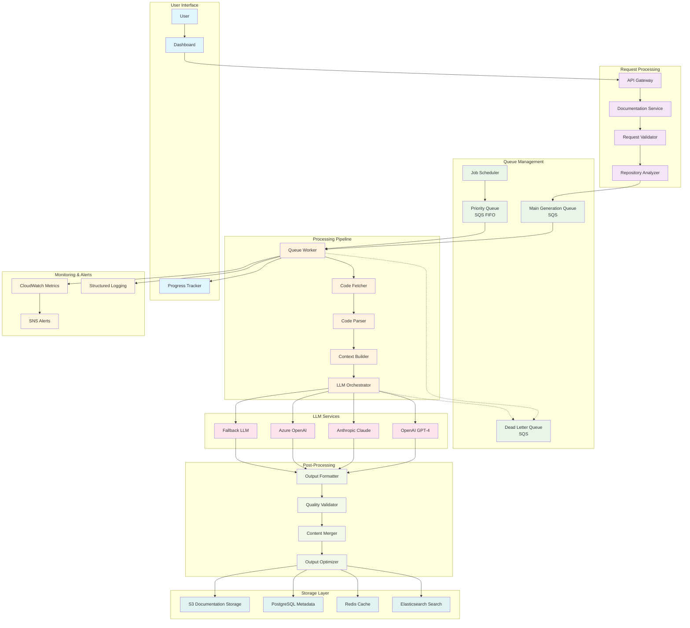

# Documentation Generation Architecture

## Overview

The documentation generation system is the core component of the Lexicode SaaS platform, responsible for analyzing code repositories and generating comprehensive documentation using Large Language Models (LLMs). The system is designed for scalability, reliability, and cost-effectiveness while maintaining high-quality output.

## Generation Flow Architecture



## Detailed Generation Process

### 1. Request Initiation

```typescript
// src/services/documentation-service.ts
export class DocumentationService {
  async initiateGeneration(request: GenerationRequest): Promise<GenerationJob> {
    // Validate request
    const validation = await this.validateGenerationRequest(request);
    if (!validation.isValid) {
      throw new Error(`Invalid request: ${validation.errors.join(', ')}`);
    }

    // Analyze repository structure
    const analysis = await this.analyzeRepository(request.repositoryId);
    
    // Estimate cost and complexity
    const estimate = await this.estimateGeneration(analysis);
    
    // Check user quota
    await this.checkUserQuota(request.userId, estimate);
    
    // Create generation job
    const job = await this.createGenerationJob({
      ...request,
      analysis,
      estimate,
      status: 'QUEUED',
      priority: this.calculatePriority(request.userId, estimate)
    });
    
    // Queue the job
    await this.queueGenerationJob(job);
    
    return job;
  }

  private async validateGenerationRequest(request: GenerationRequest): Promise<ValidationResult> {
    const errors: string[] = [];
    
    // Check repository exists and is accessible
    const repository = await this.repositoryService.getRepository(request.repositoryId);
    if (!repository) {
      errors.push('Repository not found');
    }
    
    // Check user permissions
    const hasPermission = await this.authService.hasRepositoryAccess(
      request.userId, 
      request.repositoryId
    );
    if (!hasPermission) {
      errors.push('Insufficient permissions');
    }
    
    // Check branch exists
    const branchExists = await this.githubService.branchExists(
      repository.fullName, 
      request.branch
    );
    if (!branchExists) {
      errors.push('Branch not found');
    }
    
    return {
      isValid: errors.length === 0,
      errors
    };
  }
}
```

### 2. Repository Analysis

```typescript
// src/services/repository-analyzer.ts
export class RepositoryAnalyzer {
  async analyzeRepository(repositoryId: string): Promise<RepositoryAnalysis> {
    const repository = await this.repositoryService.getRepository(repositoryId);
    
    // Fetch repository structure
    const structure = await this.githubService.getRepositoryStructure(
      repository.fullName,
      repository.defaultBranch
    );
    
    // Analyze file types and languages
    const languages = await this.analyzeLanguages(structure);
    
    // Identify documentation patterns
    const patterns = await this.identifyPatterns(structure);
    
    // Calculate complexity metrics
    const complexity = await this.calculateComplexity(structure, languages);
    
    // Estimate processing requirements
    const requirements = await this.estimateRequirements(complexity);
    
    return {
      repositoryId,
      structure,
      languages,
      patterns,
      complexity,
      requirements,
      analyzedAt: new Date()
    };
  }

  private async analyzeLanguages(structure: FileStructure): Promise<LanguageAnalysis> {
    const languageStats: Record<string, LanguageStats> = {};
    
    for (const file of structure.files) {
      const extension = path.extname(file.path);
      const language = this.getLanguageFromExtension(extension);
      
      if (!languageStats[language]) {
        languageStats[language] = {
          fileCount: 0,
          lineCount: 0,
          complexity: 0
        };
      }
      
      languageStats[language].fileCount++;
      languageStats[language].lineCount += file.lineCount;
      languageStats[language].complexity += await this.calculateFileComplexity(file);
    }
    
    return {
      primary: this.findPrimaryLanguage(languageStats),
      secondary: this.findSecondaryLanguages(languageStats),
      stats: languageStats
    };
  }
}
```

### 3. Queue Management

```typescript
// src/services/queue-service.ts
export class QueueService {
  private queues = {
    main: process.env.MAIN_QUEUE_URL!,
    priority: process.env.PRIORITY_QUEUE_URL!,
    dlq: process.env.DLQ_URL!
  };

  async queueGenerationJob(job: GenerationJob): Promise<void> {
    const queueUrl = job.priority === 'HIGH' ? this.queues.priority : this.queues.main;
    
    const message = {
      jobId: job.id,
      type: 'DOCUMENTATION_GENERATION',
      payload: {
        repositoryId: job.repositoryId,
        userId: job.userId,
        config: job.config,
        analysis: job.analysis
      },
      metadata: {
        queuedAt: new Date().toISOString(),
        priority: job.priority,
        estimatedDuration: job.estimate.duration,
        estimatedCost: job.estimate.cost
      }
    };

    await this.sqs.sendMessage({
      QueueUrl: queueUrl,
      MessageBody: JSON.stringify(message),
      MessageAttributes: {
        jobType: {
          DataType: 'String',
          StringValue: 'DOCUMENTATION_GENERATION'
        },
        priority: {
          DataType: 'String',
          StringValue: job.priority
        },
        userId: {
          DataType: 'String',
          StringValue: job.userId
        }
      },
      // For FIFO queues
      MessageGroupId: job.priority === 'HIGH' ? job.userId : undefined,
      MessageDeduplicationId: job.priority === 'HIGH' ? job.id : undefined
    }).promise();
  }

  async processQueue(): Promise<void> {
    const workers = [
      this.processMainQueue(),
      this.processPriorityQueue()
    ];

    await Promise.all(workers);
  }

  private async processMainQueue(): Promise<void> {
    await this.processMessages(this.queues.main, this.handleGenerationJob.bind(this));
  }

  private async processPriorityQueue(): Promise<void> {
    await this.processMessages(this.queues.priority, this.handleGenerationJob.bind(this));
  }
}
```

### 4. LLM Integration and Orchestration

```typescript
// src/services/llm-orchestrator.ts
export class LLMOrchestrator {
  private providers = {
    openai: new OpenAIService(),
    anthropic: new AnthropicService(),
    azure: new AzureOpenAIService()
  };

  async generateDocumentation(
    codeContext: CodeContext,
    config: GenerationConfig
  ): Promise<DocumentationResult> {
    const strategy = this.selectStrategy(codeContext, config);
    
    try {
      switch (strategy.approach) {
        case 'BATCH':
          return await this.batchGeneration(codeContext, config, strategy);
        case 'STREAMING':
          return await this.streamingGeneration(codeContext, config, strategy);
        case 'ITERATIVE':
          return await this.iterativeGeneration(codeContext, config, strategy);
        default:
          throw new Error(`Unknown generation approach: ${strategy.approach}`);
      }
    } catch (error) {
      return await this.handleGenerationError(error, codeContext, config);
    }
  }

  private async batchGeneration(
    codeContext: CodeContext,
    config: GenerationConfig,
    strategy: GenerationStrategy
  ): Promise<DocumentationResult> {
    const chunks = this.chunkCodeContext(codeContext, strategy.chunkSize);
    const results: DocumentationChunk[] = [];
    
    // Process chunks in parallel with concurrency limit
    const semaphore = new Semaphore(strategy.concurrency);
    
    const promises = chunks.map(async (chunk, index) => {
      await semaphore.acquire();
      
      try {
        const result = await this.generateChunk(chunk, config, strategy.provider);
        results[index] = result;
      } finally {
        semaphore.release();
      }
    });
    
    await Promise.all(promises);
    
    // Merge results
    return await this.mergeDocumentationChunks(results);
  }

  private async generateChunk(
    chunk: CodeChunk,
    config: GenerationConfig,
    provider: string
  ): Promise<DocumentationChunk> {
    const prompt = this.buildPrompt(chunk, config);
    const llmService = this.providers[provider];
    
    const response = await this.withRetry(
      () => llmService.generateDocumentation(prompt, {
        temperature: config.creativity,
        maxTokens: config.maxTokens,
        model: config.model
      }),
      3, // max retries
      1000 // initial delay
    );
    
    return {
      chunkId: chunk.id,
      content: response.content,
      metadata: {
        model: response.model,
        tokensUsed: response.usage.totalTokens,
        cost: this.calculateCost(response.usage, provider),
        generatedAt: new Date()
      }
    };
  }

  private buildPrompt(chunk: CodeChunk, config: GenerationConfig): string {
    const basePrompt = `
You are a technical documentation expert. Generate comprehensive documentation for the following code.

Context:
- Language: ${chunk.language}
- File: ${chunk.filePath}
- Project: ${chunk.projectName}

Requirements:
- Style: ${config.style}
- Audience: ${config.audience}
- Detail Level: ${config.detailLevel}
- Include examples: ${config.includeExamples}

Code:
\`\`\`${chunk.language}
${chunk.content}
\`\`\`

Generate documentation that includes:
1. Overview and purpose
2. Function/class descriptions
3. Parameter explanations
4. Return value descriptions
5. Usage examples (if requested)
6. Error handling information
7. Related dependencies

Format the output as markdown.
`;

    return basePrompt;
  }

  private selectStrategy(
    codeContext: CodeContext,
    config: GenerationConfig
  ): GenerationStrategy {
    const totalSize = codeContext.files.reduce((sum, file) => sum + file.size, 0);
    const complexity = codeContext.complexity;
    
    // Size-based strategy selection
    if (totalSize < 50000) { // < 50KB
      return {
        approach: 'BATCH',
        provider: 'openai',
        chunkSize: 8000,
        concurrency: 3,
        model: 'gpt-4'
      };
    } else if (totalSize < 200000) { // < 200KB
      return {
        approach: 'STREAMING',
        provider: 'anthropic',
        chunkSize: 12000,
        concurrency: 2,
        model: 'claude-3-sonnet'
      };
    } else { // Large repositories
      return {
        approach: 'ITERATIVE',
        provider: 'azure',
        chunkSize: 16000,
        concurrency: 1,
        model: 'gpt-4-32k'
      };
    }
  }
}
```

### 5. LLM Provider Services

```typescript
// src/services/llm-providers/openai-service.ts
export class OpenAIService implements LLMProvider {
  private client: OpenAI;
  
  constructor() {
    this.client = new OpenAI({
      apiKey: process.env.OPENAI_API_KEY
    });
  }

  async generateDocumentation(
    prompt: string,
    options: GenerationOptions
  ): Promise<LLMResponse> {
    const response = await this.client.chat.completions.create({
      model: options.model || 'gpt-4',
      messages: [
        {
          role: 'system',
          content: 'You are a technical documentation expert specializing in code documentation.'
        },
        {
          role: 'user',
          content: prompt
        }
      ],
      temperature: options.temperature || 0.3,
      max_tokens: options.maxTokens || 4000,
      top_p: 1,
      frequency_penalty: 0,
      presence_penalty: 0
    });

    return {
      content: response.choices[0].message.content || '',
      model: response.model,
      usage: {
        promptTokens: response.usage?.prompt_tokens || 0,
        completionTokens: response.usage?.completion_tokens || 0,
        totalTokens: response.usage?.total_tokens || 0
      },
      metadata: {
        finishReason: response.choices[0].finish_reason,
        responseTime: Date.now()
      }
    };
  }
}

// src/services/llm-providers/anthropic-service.ts
export class AnthropicService implements LLMProvider {
  private client: Anthropic;
  
  constructor() {
    this.client = new Anthropic({
      apiKey: process.env.ANTHROPIC_API_KEY
    });
  }

  async generateDocumentation(
    prompt: string,
    options: GenerationOptions
  ): Promise<LLMResponse> {
    const response = await this.client.messages.create({
      model: options.model || 'claude-3-sonnet-20240229',
      max_tokens: options.maxTokens || 4000,
      temperature: options.temperature || 0.3,
      system: 'You are a technical documentation expert specializing in code documentation.',
      messages: [
        {
          role: 'user',
          content: prompt
        }
      ]
    });

    return {
      content: response.content[0].type === 'text' ? response.content[0].text : '',
      model: response.model,
      usage: {
        promptTokens: response.usage.input_tokens,
        completionTokens: response.usage.output_tokens,
        totalTokens: response.usage.input_tokens + response.usage.output_tokens
      },
      metadata: {
        finishReason: response.stop_reason,
        responseTime: Date.now()
      }
    };
  }
}
```

### 6. Context Management and Optimization

```typescript
// src/services/context-builder.ts
export class ContextBuilder {
  async buildContext(
    repositoryAnalysis: RepositoryAnalysis,
    config: GenerationConfig
  ): Promise<CodeContext> {
    // Build dependency graph
    const dependencyGraph = await this.buildDependencyGraph(repositoryAnalysis);
    
    // Identify key files
    const keyFiles = await this.identifyKeyFiles(repositoryAnalysis, dependencyGraph);
    
    // Extract code chunks with context
    const chunks = await this.extractContextualChunks(keyFiles, dependencyGraph);
    
    // Optimize context for LLM consumption
    const optimizedContext = await this.optimizeContext(chunks, config);
    
    return optimizedContext;
  }

  private async buildDependencyGraph(
    analysis: RepositoryAnalysis
  ): Promise<DependencyGraph> {
    const graph = new DependencyGraph();
    
    for (const file of analysis.structure.files) {
      // Parse imports and dependencies
      const dependencies = await this.parseFileDependencies(file);
      
      // Add nodes and edges
      graph.addNode(file.path, {
        language: file.language,
        size: file.size,
        complexity: file.complexity
      });
      
      for (const dep of dependencies) {
        graph.addEdge(file.path, dep.path, {
          type: dep.type,
          importance: dep.importance
        });
      }
    }
    
    return graph;
  }

  private async optimizeContext(
    chunks: CodeChunk[],
    config: GenerationConfig
  ): Promise<CodeContext> {
    // Sort chunks by importance
    const sortedChunks = chunks.sort((a, b) => b.importance - a.importance);
    
    // Apply token budget
    const budgetedChunks = await this.applyTokenBudget(sortedChunks, config.tokenBudget);
    
    // Add cross-references
    const linkedChunks = await this.addCrossReferences(budgetedChunks);
    
    return {
      files: linkedChunks,
      complexity: this.calculateOverallComplexity(linkedChunks),
      dependencies: this.extractDependencies(linkedChunks),
      metadata: {
        totalFiles: linkedChunks.length,
        totalSize: linkedChunks.reduce((sum, chunk) => sum + chunk.size, 0),
          estimatedTokens: this.estimateTokenCount(linkedChunks)
      }
    };
  }
}
```

### 7. Error Handling and Resilience

```typescript
// src/services/error-handler.ts
export class GenerationErrorHandler {
  async handleError(
    error: Error,
    context: GenerationContext,
    attempt: number
  ): Promise<ErrorHandlingResult> {
    const errorType = this.classifyError(error);
    
    switch (errorType) {
      case 'RATE_LIMIT':
        return await this.handleRateLimitError(error, context, attempt);
      case 'QUOTA_EXCEEDED':
        return await this.handleQuotaError(error, context, attempt);
      case 'TIMEOUT':
        return await this.handleTimeoutError(error, context, attempt);
      case 'INVALID_INPUT':
        return await this.handleInputError(error, context, attempt);
      case 'PROVIDER_ERROR':
        return await this.handleProviderError(error, context, attempt);
      default:
        return await this.handleUnknownError(error, context, attempt);
    }
  }

  private async handleRateLimitError(
    error: Error,
    context: GenerationContext,
    attempt: number
  ): Promise<ErrorHandlingResult> {
    const retryAfter = this.extractRetryAfter(error);
    
    if (attempt < 3) {
      // Exponential backoff with jitter
      const delay = Math.min(
        retryAfter || (1000 * Math.pow(2, attempt)),
        30000 // Max 30 seconds
      ) + Math.random() * 1000;
      
      await this.delay(delay);
      
      return {
        action: 'RETRY',
        delay,
        newProvider: this.selectAlternativeProvider(context.currentProvider)
      };
    }
    
    return {
      action: 'FAIL',
      reason: 'Rate limit exceeded after maximum retries'
    };
  }

  private async handleProviderError(
    error: Error,
    context: GenerationContext,
    attempt: number
  ): Promise<ErrorHandlingResult> {
    // Try alternative provider
    const alternativeProvider = this.selectAlternativeProvider(context.currentProvider);
    
    if (alternativeProvider && attempt < 2) {
      return {
        action: 'RETRY',
        newProvider: alternativeProvider,
        delay: 1000
      };
    }
    
    // Fallback to simplified generation
    if (attempt < 3) {
      return {
        action: 'RETRY',
        newProvider: 'fallback',
        simplifiedConfig: this.createSimplifiedConfig(context.config)
      };
    }
    
    return {
      action: 'FAIL',
      reason: 'All providers failed'
    };
  }
}
```

### 8. Quality Assurance and Validation

```typescript
// src/services/quality-validator.ts
export class QualityValidator {
  async validateDocumentation(
    documentation: GeneratedDocumentation,
    originalCode: CodeContext
  ): Promise<ValidationResult> {
    const checks = await Promise.all([
      this.checkCompleteness(documentation, originalCode),
      this.checkAccuracy(documentation, originalCode),
      this.checkConsistency(documentation),
      this.checkReadability(documentation),
      this.checkStructure(documentation)
    ]);

    const overallScore = this.calculateOverallScore(checks);
    const issues = this.extractIssues(checks);

    return {
      score: overallScore,
      passed: overallScore >= 0.8, // 80% threshold
      issues,
      suggestions: this.generateSuggestions(issues),
      metadata: {
        validatedAt: new Date(),
        checks: checks.map(c => c.name)
      }
    };
  }

  private async checkCompleteness(
    documentation: GeneratedDocumentation,
    originalCode: CodeContext
  ): Promise<ValidationCheck> {
    const codeElements = this.extractCodeElements(originalCode);
    const documentedElements = this.extractDocumentedElements(documentation);
    
    const coverage = documentedElements.length / codeElements.length;
    const missing = codeElements.filter(
      element => !documentedElements.includes(element)
    );

    return {
      name: 'completeness',
      score: coverage,
      passed: coverage >= 0.9,
      details: {
        coverage,
        missing,
        total: codeElements.length,
        documented: documentedElements.length
      }
    };
  }

  private async checkAccuracy(
    documentation: GeneratedDocumentation,
    originalCode: CodeContext
  ): Promise<ValidationCheck> {
    // Use simple heuristics to check accuracy
    const signatures = this.extractFunctionSignatures(originalCode);
    const documentedSignatures = this.extractDocumentedSignatures(documentation);
    
    let matches = 0;
    let total = 0;
    
    for (const sig of signatures) {
      total++;
      const docSig = documentedSignatures.find(d => d.name === sig.name);
      if (docSig && this.signaturesMatch(sig, docSig)) {
        matches++;
      }
    }
    
    const accuracy = total > 0 ? matches / total : 1;
    
    return {
      name: 'accuracy',
      score: accuracy,
      passed: accuracy >= 0.95,
      details: {
        accuracy,
        matches,
        total,
        mismatches: total - matches
      }
    };
  }
}
```

### 9. Cost Management and Optimization

```typescript
// src/services/cost-manager.ts
export class CostManager {
  private costs = {
    openai: {
      'gpt-4': { input: 0.03, output: 0.06 }, // per 1K tokens
      'gpt-3.5-turbo': { input: 0.001, output: 0.002 }
    },
    anthropic: {
      'claude-3-sonnet': { input: 0.003, output: 0.015 },
      'claude-3-haiku': { input: 0.00025, output: 0.00125 }
    },
    azure: {
      'gpt-4': { input: 0.03, output: 0.06 }
    }
  };

  async optimizeGenerationCost(
    context: CodeContext,
    config: GenerationConfig,
    budget: number
  ): Promise<OptimizedGenerationPlan> {
    const estimates = await this.estimateProviderCosts(context, config);
    
    // Select most cost-effective provider within budget
    const viableOptions = estimates.filter(est => est.cost <= budget);
    
    if (viableOptions.length === 0) {
      // Need to reduce scope or quality
      return await this.createBudgetConstrainedPlan(context, config, budget);
    }
    
    // Select best option (balance cost, quality, and speed)
    const bestOption = this.selectBestOption(viableOptions);
    
    return {
      provider: bestOption.provider,
      model: bestOption.model,
      estimatedCost: bestOption.cost,
      estimatedDuration: bestOption.duration,
      adjustments: bestOption.adjustments
    };
  }

  private async estimateProviderCosts(
    context: CodeContext,
    config: GenerationConfig
  ): Promise<CostEstimate[]> {
    const estimates: CostEstimate[] = [];
    
    for (const [provider, models] of Object.entries(this.costs)) {
      for (const [model, pricing] of Object.entries(models)) {
        const tokenEstimate = this.estimateTokenUsage(context, model);
        const cost = this.calculateCost(tokenEstimate, pricing);
        
        estimates.push({
          provider,
          model,
          cost,
          duration: this.estimateDuration(tokenEstimate, provider),
          quality: this.estimateQuality(model),
          reliability: this.getReliabilityScore(provider)
        });
      }
    }
    
    return estimates;
  }

  private calculateCost(
    tokenEstimate: TokenEstimate,
    pricing: ModelPricing
  ): number {
    const inputCost = (tokenEstimate.input / 1000) * pricing.input;
    const outputCost = (tokenEstimate.output / 1000) * pricing.output;
    return inputCost + outputCost;
  }
}
```

### 10. Real-time Progress Tracking

```typescript
// src/services/progress-tracker.ts
export class ProgressTracker {
  private progressUpdates = new Map<string, GenerationProgress>();
  
  async trackProgress(
    jobId: string,
    stage: GenerationStage,
    progress: number,
    details?: any
  ): Promise<void> {
    const update: GenerationProgress = {
      jobId,
      stage,
      progress: Math.min(Math.max(progress, 0), 1), // Clamp between 0 and 1
      details,
      timestamp: new Date()
    };
    
    this.progressUpdates.set(jobId, update);
    
    // Send real-time update to user
    await this.sendProgressUpdate(jobId, update);
    
    // Store in database
    await this.storeProgressUpdate(update);
  }

  private async sendProgressUpdate(
    jobId: string,
    progress: GenerationProgress
  ): Promise<void> {
    // WebSocket update
    await this.websocketService.sendToJob(jobId, {
      type: 'PROGRESS_UPDATE',
      data: progress
    });
    
    // Optional: Push notification for mobile
    if (progress.stage === 'COMPLETED') {
      await this.pushNotificationService.sendCompletion(jobId);
    }
  }

  async getProgressSummary(jobId: string): Promise<ProgressSummary> {
    const job = await this.getGenerationJob(jobId);
    const currentProgress = this.progressUpdates.get(jobId);
    
    return {
      jobId,
      status: job.status,
      currentStage: currentProgress?.stage || 'INITIALIZING',
      overallProgress: this.calculateOverallProgress(job, currentProgress),
      estimatedTimeRemaining: this.calculateTimeRemaining(job, currentProgress),
      stages: [
        { name: 'INITIALIZING', progress: 1, completed: true },
        { name: 'ANALYZING', progress: 1, completed: true },
        { name: 'GENERATING', progress: currentProgress?.progress || 0, completed: false },
        { name: 'PROCESSING', progress: 0, completed: false },
        { name: 'FINALIZING', progress: 0, completed: false }
      ]
    };
  }
}
```

## Performance Optimization Strategies

### 1. Token Management
- **Context Window Optimization**: Intelligently chunk code to fit within model context windows
- **Token Budget Allocation**: Distribute tokens based on code importance and complexity
- **Compression Techniques**: Remove comments, whitespace, and redundant code for context building

### 2. Caching Strategy
- **Response Caching**: Cache generated documentation for identical code blocks
- **Context Caching**: Cache analyzed code contexts for similar repositories
- **Template Caching**: Cache common documentation templates and patterns

### 3. Parallel Processing
- **Concurrent Generation**: Process multiple files simultaneously within rate limits
- **Pipeline Optimization**: Overlap analysis, generation, and post-processing phases
- **Load Balancing**: Distribute requests across multiple provider accounts

### 4. Quality vs Speed Trade-offs
- **Tiered Quality**: Offer different quality levels (fast, balanced, comprehensive)
- **Progressive Enhancement**: Start with basic documentation and enhance incrementally
- **User Preferences**: Allow users to choose between speed and quality

## Error Recovery and Fallback Strategies

### 1. Provider Failover
```typescript
const fallbackChain = [
  'openai-gpt4',
  'anthropic-claude',
  'azure-openai',
  'openai-gpt3.5',
  'local-model'
];
```

### 2. Degraded Service Modes
- **Simplified Generation**: Reduce documentation scope when facing constraints
- **Template-based Fallback**: Use pre-built templates when AI generation fails
- **Partial Generation**: Generate documentation for successfully processed files

### 3. Error Classification and Handling
- **Transient Errors**: Retry with exponential backoff
- **Permanent Errors**: Skip problematic files and continue with others
- **Rate Limit Errors**: Queue for later processing or switch providers

## Monitoring and Observability

### Key Metrics
- **Generation Success Rate**: Percentage of successful generations
- **Average Generation Time**: Time from request to completion
- **Cost per Generation**: Total cost including retries and failures
- **Quality Scores**: Automated quality assessment scores
- **User Satisfaction**: User ratings and feedback

### Alerting Rules
- Generation failure rate > 5%
- Average generation time > 10 minutes
- Cost per generation > budget threshold
- Provider error rate > 1%
- Queue depth > 100 jobs

This comprehensive documentation generation architecture ensures reliable, cost-effective, and high-quality AI-powered documentation generation while maintaining scalability and user experience.