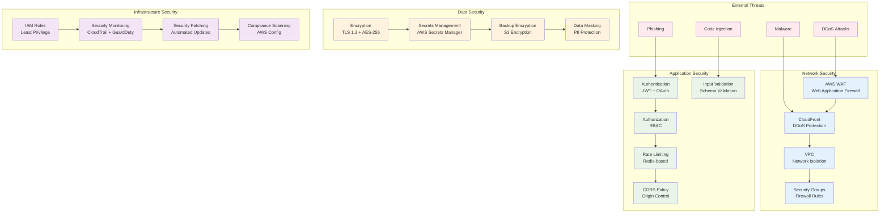

# Security Architecture and Compliance

## Overview

The Lexicode SaaS platform implements comprehensive security measures across all layers of the architecture, following industry best practices and compliance requirements. Security is designed with a zero-trust model, defense in depth, and continuous monitoring.

## Security Framework



## Network Security

### Web Application Firewall (WAF)

```yaml
# AWS WAF Configuration
AWSTemplateFormatVersion: '2010-09-09'
Description: 'AWS WAF Configuration for Lexicode'

Resources:
  LexicodeWebACL:
    Type: AWS::WAFv2::WebACL
    Properties:
      Name: lexicode-web-acl
      Scope: CLOUDFRONT
      DefaultAction:
        Allow: {}
      Rules:
        - Name: AWSManagedRulesCommonRuleSet
          Priority: 1
          OverrideAction:
            None: {}
          Statement:
            ManagedRuleGroupStatement:
              VendorName: AWS
              Name: AWSManagedRulesCommonRuleSet
          VisibilityConfig:
            SampledRequestsEnabled: true
            CloudWatchMetricsEnabled: true
            MetricName: CommonRuleSetMetric
            
        - Name: AWSManagedRulesKnownBadInputsRuleSet
          Priority: 2
          OverrideAction:
            None: {}
          Statement:
            ManagedRuleGroupStatement:
              VendorName: AWS
              Name: AWSManagedRulesKnownBadInputsRuleSet
          VisibilityConfig:
            SampledRequestsEnabled: true
            CloudWatchMetricsEnabled: true
            MetricName: KnownBadInputsMetric
            
        - Name: AWSManagedRulesSQLiRuleSet
          Priority: 3
          OverrideAction:
            None: {}
          Statement:
            ManagedRuleGroupStatement:
              VendorName: AWS
              Name: AWSManagedRulesSQLiRuleSet
          VisibilityConfig:
            SampledRequestsEnabled: true
            CloudWatchMetricsEnabled: true
            MetricName: SQLiRuleSetMetric
            
        - Name: RateLimitRule
          Priority: 4
          Action:
            Block: {}
          Statement:
            RateBasedStatement:
              Limit: 2000
              AggregateKeyType: IP
          VisibilityConfig:
            SampledRequestsEnabled: true
            CloudWatchMetricsEnabled: true
            MetricName: RateLimitMetric
```

### Network Isolation

```hcl
# VPC Security Configuration
resource "aws_vpc" "lexicode_vpc" {
  cidr_block           = "10.0.0.0/16"
  enable_dns_hostnames = true
  enable_dns_support   = true
  
  tags = {
    Name = "lexicode-vpc"
  }
}

# Network ACLs
resource "aws_network_acl" "private_nacl" {
  vpc_id = aws_vpc.lexicode_vpc.id
  
  # Inbound rules
  ingress {
    rule_no    = 100
    protocol   = "tcp"
    action     = "allow"
    cidr_block = "10.0.0.0/16"
    from_port  = 3000
    to_port    = 3000
  }
  
  ingress {
    rule_no    = 110
    protocol   = "tcp"
    action     = "allow"
    cidr_block = "10.0.0.0/16"
    from_port  = 5432
    to_port    = 5432
  }
  
  # Outbound rules
  egress {
    rule_no    = 100
    protocol   = "tcp"
    action     = "allow"
    cidr_block = "0.0.0.0/0"
    from_port  = 443
    to_port    = 443
  }
  
  egress {
    rule_no    = 110
    protocol   = "tcp"
    action     = "allow"
    cidr_block = "0.0.0.0/0"
    from_port  = 80
    to_port    = 80
  }
  
  tags = {
    Name = "lexicode-private-nacl"
  }
}
```

## Application Security

### Authentication and Authorization

```typescript
// src/auth/services/auth-service.ts
import jwt from 'jsonwebtoken';
import bcrypt from 'bcryptjs';
import { User } from '../models/user';
import { RateLimiter } from '../utils/rate-limiter';

export class AuthService {
  private rateLimiter = new RateLimiter();
  
  async login(email: string, password: string, ip: string): Promise<{ user: User; token: string }> {
    // Rate limiting
    await this.rateLimiter.checkLimit(`login:${ip}`, 5, 900); // 5 attempts per 15 minutes
    
    // Find user
    const user = await User.findOne({ email });
    if (!user) {
      throw new Error('Invalid credentials');
    }
    
    // Verify password
    const isPasswordValid = await bcrypt.compare(password, user.passwordHash);
    if (!isPasswordValid) {
      await this.rateLimiter.increment(`login:${ip}`);
      throw new Error('Invalid credentials');
    }
    
    // Generate JWT token
    const token = jwt.sign(
      { 
        userId: user.id,
        email: user.email,
        roles: user.roles 
      },
      process.env.JWT_SECRET!,
      { 
        expiresIn: '1h',
        issuer: 'lexicode-api',
        audience: 'lexicode-client'
      }
    );
    
    // Log successful login
    await this.logSecurityEvent('LOGIN_SUCCESS', user.id, ip);
    
    return { user, token };
  }
  
  async validateToken(token: string): Promise<User> {
    try {
      const decoded = jwt.verify(token, process.env.JWT_SECRET!) as any;
      const user = await User.findById(decoded.userId);
      
      if (!user || !user.isActive) {
        throw new Error('User not found or inactive');
      }
      
      return user;
    } catch (error) {
      throw new Error('Invalid token');
    }
  }
  
  private async logSecurityEvent(event: string, userId: string, ip: string) {
    await SecurityLog.create({
      event,
      userId,
      ipAddress: ip,
      timestamp: new Date(),
      userAgent: 'Unknown'
    });
  }
}
```

### Input Validation and Sanitization

```typescript
// src/middleware/validation.ts
import { Request, Response, NextFunction } from 'express';
import { z, ZodSchema } from 'zod';
import DOMPurify from 'dompurify';
import { JSDOM } from 'jsdom';

const window = new JSDOM('').window;
const purify = DOMPurify(window);

export const validateRequest = (schema: ZodSchema) => {
  return (req: Request, res: Response, next: NextFunction) => {
    try {
      // Validate request body
      const validatedData = schema.parse(req.body);
      
      // Sanitize string fields
      const sanitizedData = sanitizeObject(validatedData);
      
      req.body = sanitizedData;
      next();
    } catch (error) {
      if (error instanceof z.ZodError) {
        return res.status(400).json({
          error: 'Validation failed',
          details: error.errors
        });
      }
      
      return res.status(400).json({
        error: 'Invalid request data'
      });
    }
  };
};

function sanitizeObject(obj: any): any {
  if (typeof obj === 'string') {
    return purify.sanitize(obj);
  }
  
  if (Array.isArray(obj)) {
    return obj.map(sanitizeObject);
  }
  
  if (typeof obj === 'object' && obj !== null) {
    const sanitized: any = {};
    for (const [key, value] of Object.entries(obj)) {
      sanitized[key] = sanitizeObject(value);
    }
    return sanitized;
  }
  
  return obj;
}

// Schema definitions
export const registerSchema = z.object({
  email: z.string().email().max(255),
  password: z.string().min(8).max(128).regex(/^(?=.*[a-z])(?=.*[A-Z])(?=.*\d)(?=.*[@$!%*?&])[A-Za-z\d@$!%*?&]/),
  fullName: z.string().min(1).max(255),
  agreeToTerms: z.boolean().refine(val => val === true, {
    message: 'Must agree to terms and conditions'
  })
});

export const loginSchema = z.object({
  email: z.string().email().max(255),
  password: z.string().min(1).max(128)
});
```

### Rate Limiting

```typescript
// src/utils/rate-limiter.ts
import Redis from 'ioredis';

export class RateLimiter {
  private redis: Redis;
  
  constructor() {
    this.redis = new Redis(process.env.REDIS_URL!);
  }
  
  async checkLimit(key: string, maxRequests: number, windowSeconds: number): Promise<void> {
    const current = await this.redis.get(key);
    
    if (current && parseInt(current) >= maxRequests) {
      const ttl = await this.redis.ttl(key);
      throw new Error(`Rate limit exceeded. Try again in ${ttl} seconds.`);
    }
  }
  
  async increment(key: string, windowSeconds: number = 900): Promise<number> {
    const pipeline = this.redis.pipeline();
    pipeline.incr(key);
    pipeline.expire(key, windowSeconds);
    
    const results = await pipeline.exec();
    return results![0][1] as number;
  }
}

// Rate limiting middleware
export const rateLimitMiddleware = (
  maxRequests: number = 100,
  windowSeconds: number = 900
) => {
  const limiter = new RateLimiter();
  
  return async (req: Request, res: Response, next: NextFunction) => {
    try {
      const key = `rate_limit:${req.ip}:${req.path}`;
      await limiter.checkLimit(key, maxRequests, windowSeconds);
      await limiter.increment(key, windowSeconds);
      next();
    } catch (error) {
      res.status(429).json({
        error: 'Too many requests',
        message: error.message
      });
    }
  };
};
```

## Data Security

### Encryption Configuration

```typescript
// src/utils/encryption.ts
import crypto from 'crypto';

export class EncryptionService {
  private readonly algorithm = 'aes-256-gcm';
  private readonly keyLength = 32;
  private readonly ivLength = 16;
  private readonly tagLength = 16;
  
  constructor(private encryptionKey: string) {
    if (!encryptionKey || encryptionKey.length !== 64) {
      throw new Error('Encryption key must be 64 characters (32 bytes in hex)');
    }
  }
  
  encrypt(text: string): string {
    const iv = crypto.randomBytes(this.ivLength);
    const key = Buffer.from(this.encryptionKey, 'hex');
    
    const cipher = crypto.createCipher(this.algorithm, key);
    cipher.setAAD(Buffer.from('lexicode-aad'));
    
    let encrypted = cipher.update(text, 'utf8', 'hex');
    encrypted += cipher.final('hex');
    
    const tag = cipher.getAuthTag();
    
    return iv.toString('hex') + ':' + encrypted + ':' + tag.toString('hex');
  }
  
  decrypt(encryptedText: string): string {
    const parts = encryptedText.split(':');
    if (parts.length !== 3) {
      throw new Error('Invalid encrypted text format');
    }
    
    const iv = Buffer.from(parts[0], 'hex');
    const encrypted = parts[1];
    const tag = Buffer.from(parts[2], 'hex');
    const key = Buffer.from(this.encryptionKey, 'hex');
    
    const decipher = crypto.createDecipher(this.algorithm, key);
    decipher.setAAD(Buffer.from('lexicode-aad'));
    decipher.setAuthTag(tag);
    
    let decrypted = decipher.update(encrypted, 'hex', 'utf8');
    decrypted += decipher.final('utf8');
    
    return decrypted;
  }
  
  hash(data: string): string {
    return crypto.createHash('sha256').update(data).digest('hex');
  }
}
```

### Secrets Management

```typescript
// src/config/secrets.ts
import { SecretsManager } from 'aws-sdk';

export class SecretsService {
  private secretsManager: SecretsManager;
  
  constructor() {
    this.secretsManager = new SecretsManager({
      region: process.env.AWS_REGION || 'us-east-1'
    });
  }
  
  async getSecret(secretName: string): Promise<string> {
    try {
      const result = await this.secretsManager.getSecretValue({
        SecretId: secretName
      }).promise();
      
      return result.SecretString || '';
    } catch (error) {
      console.error(`Error retrieving secret ${secretName}:`, error);
      throw new Error(`Failed to retrieve secret: ${secretName}`);
    }
  }
  
  async updateSecret(secretName: string, secretValue: string): Promise<void> {
    try {
      await this.secretsManager.updateSecret({
        SecretId: secretName,
        SecretString: secretValue
      }).promise();
    } catch (error) {
      console.error(`Error updating secret ${secretName}:`, error);
      throw new Error(`Failed to update secret: ${secretName}`);
    }
  }
}

// Configuration loader
export async function loadSecrets(): Promise<Record<string, string>> {
  const secretsService = new SecretsService();
  
  const secrets = await Promise.all([
    secretsService.getSecret('lexicode/database-url'),
    secretsService.getSecret('lexicode/redis-url'),
    secretsService.getSecret('lexicode/jwt-secret'),
    secretsService.getSecret('lexicode/encryption-key'),
    secretsService.getSecret('lexicode/github-oauth-secret'),
    secretsService.getSecret('lexicode/stripe-secret-key'),
    secretsService.getSecret('lexicode/openai-api-key')
  ]);
  
  return {
    DATABASE_URL: secrets[0],
    REDIS_URL: secrets[1],
    JWT_SECRET: secrets[2],
    ENCRYPTION_KEY: secrets[3],
    GITHUB_OAUTH_SECRET: secrets[4],
    STRIPE_SECRET_KEY: secrets[5],
    OPENAI_API_KEY: secrets[6]
  };
}
```

## Security Monitoring

### Security Event Logging

```typescript
// src/services/security-logger.ts
import { CloudWatchLogs } from 'aws-sdk';

export interface SecurityEvent {
  eventType: string;
  severity: 'LOW' | 'MEDIUM' | 'HIGH' | 'CRITICAL';
  userId?: string;
  ipAddress: string;
  userAgent: string;
  resource?: string;
  details: Record<string, any>;
}

export class SecurityLogger {
  private cloudWatchLogs: CloudWatchLogs;
  private logGroupName: string;
  
  constructor() {
    this.cloudWatchLogs = new CloudWatchLogs({
      region: process.env.AWS_REGION || 'us-east-1'
    });
    this.logGroupName = '/aws/lexicode/security';
  }
  
  async logSecurityEvent(event: SecurityEvent): Promise<void> {
    const logEntry = {
      timestamp: new Date().toISOString(),
      ...event
    };
    
    try {
      await this.cloudWatchLogs.putLogEvents({
        logGroupName: this.logGroupName,
        logStreamName: `security-${new Date().toISOString().split('T')[0]}`,
        logEvents: [
          {
            timestamp: Date.now(),
            message: JSON.stringify(logEntry)
          }
        ]
      }).promise();
    } catch (error) {
      console.error('Failed to log security event:', error);
    }
  }
  
  async logAuthenticationAttempt(
    success: boolean,
    email: string,
    ipAddress: string,
    userAgent: string
  ): Promise<void> {
    await this.logSecurityEvent({
      eventType: success ? 'AUTH_SUCCESS' : 'AUTH_FAILURE',
      severity: success ? 'LOW' : 'MEDIUM',
      ipAddress,
      userAgent,
      details: {
        email,
        success
      }
    });
  }
  
  async logDataAccess(
    userId: string,
    resource: string,
    action: string,
    ipAddress: string
  ): Promise<void> {
    await this.logSecurityEvent({
      eventType: 'DATA_ACCESS',
      severity: 'LOW',
      userId,
      ipAddress,
      userAgent: 'API',
      resource,
      details: {
        action
      }
    });
  }
}
```

### Intrusion Detection

```typescript
// src/services/intrusion-detection.ts
import { SecurityLogger } from './security-logger';

export class IntrusionDetectionService {
  private securityLogger: SecurityLogger;
  
  constructor() {
    this.securityLogger = new SecurityLogger();
  }
  
  async detectAnomalousActivity(
    userId: string,
    ipAddress: string,
    userAgent: string
  ): Promise<boolean> {
    const checks = await Promise.all([
      this.checkMultipleFailedLogins(ipAddress),
      this.checkUnusualGeoLocation(userId, ipAddress),
      this.checkSuspiciousUserAgent(userAgent),
      this.checkRapidRequests(userId, ipAddress)
    ]);
    
    const suspiciousActivity = checks.some(check => check);
    
    if (suspiciousActivity) {
      await this.securityLogger.logSecurityEvent({
        eventType: 'SUSPICIOUS_ACTIVITY',
        severity: 'HIGH',
        userId,
        ipAddress,
        userAgent,
        details: {
          checks: {
            multipleFailedLogins: checks[0],
            unusualGeoLocation: checks[1],
            suspiciousUserAgent: checks[2],
            rapidRequests: checks[3]
          }
        }
      });
    }
    
    return suspiciousActivity;
  }
  
  private async checkMultipleFailedLogins(ipAddress: string): Promise<boolean> {
    // Implementation to check failed login attempts
    return false;
  }
  
  private async checkUnusualGeoLocation(userId: string, ipAddress: string): Promise<boolean> {
    // Implementation to check geolocation patterns
    return false;
  }
  
  private async checkSuspiciousUserAgent(userAgent: string): Promise<boolean> {
    // Implementation to check for bot patterns
    return false;
  }
  
  private async checkRapidRequests(userId: string, ipAddress: string): Promise<boolean> {
    // Implementation to check request patterns
    return false;
  }
}
```

## Compliance Framework

### SOC 2 Type II Compliance

```typescript
// src/compliance/soc2-controls.ts
export interface SOC2Control {
  id: string;
  category: 'Security' | 'Availability' | 'ProcessingIntegrity' | 'Confidentiality' | 'Privacy';
  description: string;
  implementation: string;
  evidence: string[];
  testing: string;
}

export const SOC2Controls: SOC2Control[] = [
  {
    id: 'CC6.1',
    category: 'Security',
    description: 'Logical and physical access controls',
    implementation: 'Multi-factor authentication, VPC isolation, IAM roles',
    evidence: ['IAM policies', 'MFA logs', 'VPC configuration'],
    testing: 'Quarterly access reviews and penetration testing'
  },
  {
    id: 'CC6.2',
    category: 'Security',
    description: 'System access is granted based on job function',
    implementation: 'Role-based access control (RBAC)',
    evidence: ['Role definitions', 'User assignments', 'Access logs'],
    testing: 'Monthly access certification reviews'
  },
  {
    id: 'CC6.3',
    category: 'Security',
    description: 'System access is monitored and reviewed',
    implementation: 'CloudTrail logging, security event monitoring',
    evidence: ['CloudTrail logs', 'Security alerts', 'Review reports'],
    testing: 'Continuous monitoring and weekly log reviews'
  }
];
```

### GDPR Compliance

```typescript
// src/compliance/gdpr-service.ts
export class GDPRService {
  async handleDataSubjectRequest(
    requestType: 'access' | 'rectification' | 'erasure' | 'portability',
    userId: string,
    requestDetails: any
  ): Promise<void> {
    switch (requestType) {
      case 'access':
        await this.handleAccessRequest(userId);
        break;
      case 'rectification':
        await this.handleRectificationRequest(userId, requestDetails);
        break;
      case 'erasure':
        await this.handleErasureRequest(userId);
        break;
      case 'portability':
        await this.handlePortabilityRequest(userId);
        break;
    }
  }
  
  private async handleAccessRequest(userId: string): Promise<void> {
    // Collect all personal data for the user
    const userData = await this.collectUserData(userId);
    
    // Log the access request
    await this.logGDPRActivity('DATA_ACCESS_REQUEST', userId, userData);
  }
  
  private async handleErasureRequest(userId: string): Promise<void> {
    // Anonymize or delete personal data
    await this.anonymizeUserData(userId);
    
    // Log the erasure request
    await this.logGDPRActivity('DATA_ERASURE_REQUEST', userId, {});
  }
  
  private async collectUserData(userId: string): Promise<any> {
    // Implementation to collect all user data
    return {};
  }
  
  private async anonymizeUserData(userId: string): Promise<void> {
    // Implementation to anonymize user data
  }
  
  private async logGDPRActivity(
    activity: string,
    userId: string,
    details: any
  ): Promise<void> {
    // Log GDPR-related activities
  }
}
```

## Incident Response

### Security Incident Response Plan

```typescript
// src/security/incident-response.ts
export interface SecurityIncident {
  id: string;
  type: 'DATA_BREACH' | 'UNAUTHORIZED_ACCESS' | 'MALWARE' | 'DDOS' | 'INSIDER_THREAT';
  severity: 'LOW' | 'MEDIUM' | 'HIGH' | 'CRITICAL';
  description: string;
  affectedSystems: string[];
  detectedAt: Date;
  reportedBy: string;
  status: 'OPEN' | 'INVESTIGATING' | 'CONTAINED' | 'RESOLVED';
}

export class IncidentResponseService {
  async reportIncident(incident: Omit<SecurityIncident, 'id' | 'detectedAt' | 'status'>): Promise<string> {
    const incidentId = this.generateIncidentId();
    
    const fullIncident: SecurityIncident = {
      ...incident,
      id: incidentId,
      detectedAt: new Date(),
      status: 'OPEN'
    };
    
    // Store incident
    await this.storeIncident(fullIncident);
    
    // Send alerts
    await this.sendIncidentAlerts(fullIncident);
    
    // Auto-contain if critical
    if (fullIncident.severity === 'CRITICAL') {
      await this.initiateAutomaticContainment(fullIncident);
    }
    
    return incidentId;
  }
  
  private async sendIncidentAlerts(incident: SecurityIncident): Promise<void> {
    // Send alerts to security team
    // Integration with PagerDuty, Slack, etc.
  }
  
  private async initiateAutomaticContainment(incident: SecurityIncident): Promise<void> {
    // Automatic containment measures
    // Block suspicious IPs, disable compromised accounts, etc.
  }
  
  private generateIncidentId(): string {
    return `INC-${Date.now()}`;
  }
  
  private async storeIncident(incident: SecurityIncident): Promise<void> {
    // Store incident in database
  }
}
```

## Security Testing

### Security Test Suite

```typescript
// src/tests/security/auth.security.test.ts
import request from 'supertest';
import { app } from '../../app';

describe('Authentication Security Tests', () => {
  describe('Brute Force Protection', () => {
    it('should block repeated failed login attempts', async () => {
      const loginPayload = {
        email: 'test@example.com',
        password: 'wrongpassword'
      };
      
      // Try to login 6 times with wrong password
      for (let i = 0; i < 6; i++) {
        await request(app)
          .post('/api/auth/login')
          .send(loginPayload)
          .expect(401);
      }
      
      // 7th attempt should be blocked
      const response = await request(app)
        .post('/api/auth/login')
        .send(loginPayload);
        
      expect(response.status).toBe(429);
      expect(response.body.error).toContain('Too many requests');
    });
  });
  
  describe('JWT Token Security', () => {
    it('should reject expired tokens', async () => {
      const expiredToken = 'eyJhbGciOiJIUzI1NiIsInR5cCI6IkpXVCJ9...'; // Expired token
      
      const response = await request(app)
        .get('/api/auth/me')
        .set('Authorization', `Bearer ${expiredToken}`);
        
      expect(response.status).toBe(401);
      expect(response.body.error).toContain('Invalid token');
    });
  });
  
  describe('SQL Injection Protection', () => {
    it('should prevent SQL injection in login', async () => {
      const maliciousPayload = {
        email: "'; DROP TABLE users; --",
        password: 'password'
      };
      
      const response = await request(app)
        .post('/api/auth/login')
        .send(maliciousPayload);
        
      expect(response.status).toBe(400);
      expect(response.body.error).toContain('Validation failed');
    });
  });
});
```

## Security Checklist

### Pre-Deployment Security Checklist

- [ ] **Network Security**
  - [ ] WAF rules configured and tested
  - [ ] Security groups follow least privilege principle
  - [ ] VPC flow logs enabled
  - [ ] DDoS protection enabled

- [ ] **Application Security**
  - [ ] All inputs validated and sanitized
  - [ ] Authentication and authorization implemented
  - [ ] Rate limiting configured
  - [ ] CORS policy configured
  - [ ] Security headers implemented

- [ ] **Data Security**
  - [ ] Data encrypted at rest and in transit
  - [ ] Secrets managed securely
  - [ ] Database credentials rotated
  - [ ] Backup encryption verified

- [ ] **Infrastructure Security**
  - [ ] IAM roles follow least privilege
  - [ ] Security patches applied
  - [ ] Monitoring and alerting configured
  - [ ] Incident response plan tested

- [ ] **Compliance**
  - [ ] SOC 2 controls implemented
  - [ ] GDPR compliance verified
  - [ ] Audit logging enabled
  - [ ] Data retention policies applied

This comprehensive security architecture ensures that the Lexicode SaaS platform maintains the highest security standards while meeting compliance requirements and protecting user data at every layer.