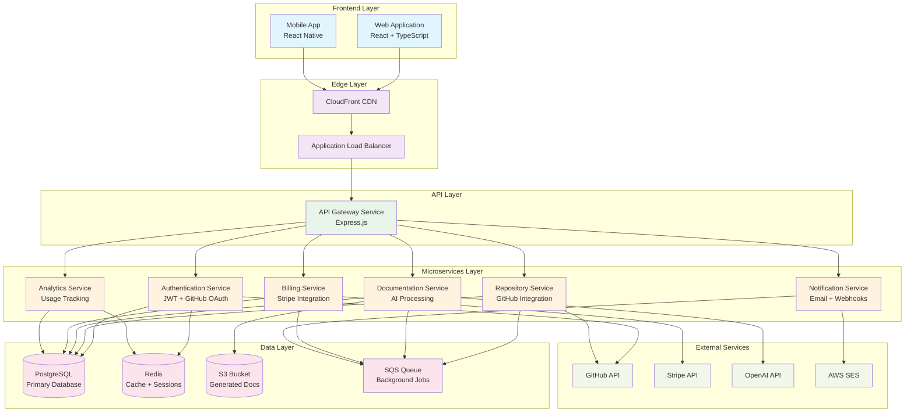
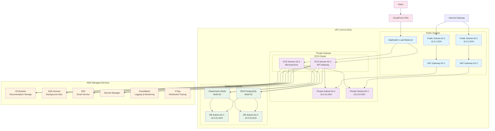
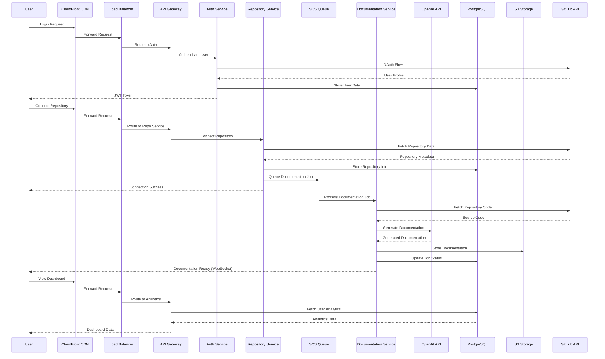
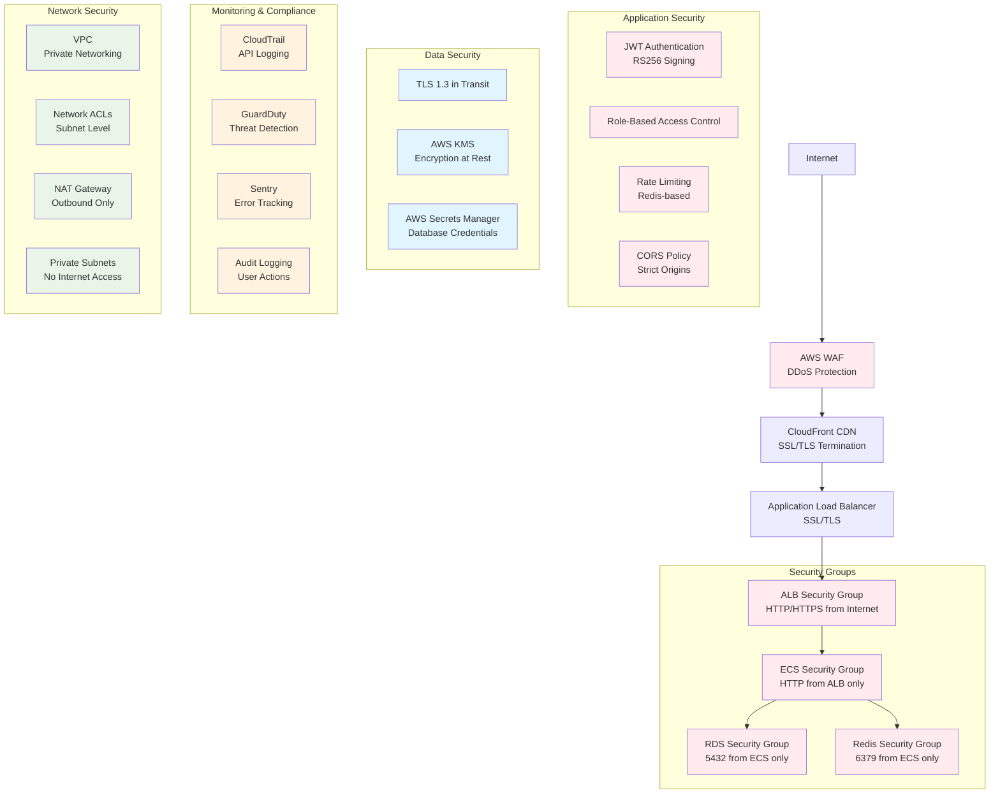
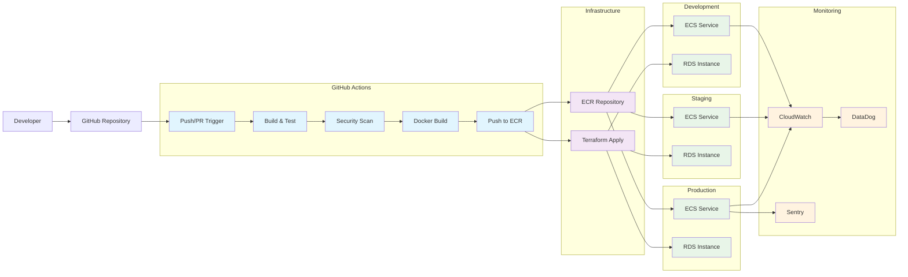

# System Architecture Diagrams

## High-Level System Architecture

```mermaid
graph TB
    %% Frontend Layer
    subgraph "Frontend Layer"
        WEB[Web Application<br/>React + TypeScript]
        MOBILE[Mobile App<br/>React Native]
    end

    %% CDN and Load Balancing
    subgraph "Edge Layer"
        CDN[CloudFront CDN]
        ALB[Application Load Balancer]
    end

    %% API Gateway
    subgraph "API Layer"
        GATEWAY[API Gateway Service<br/>Express.js]
    end

    %% Core Services
    subgraph "Microservices Layer"
        AUTH[Authentication Service<br/>JWT + GitHub OAuth]
        REPO[Repository Service<br/>GitHub Integration]
        DOC[Documentation Service<br/>AI Processing]
        BILLING[Billing Service<br/>Stripe Integration]
        ANALYTICS[Analytics Service<br/>Usage Tracking]
        NOTIFY[Notification Service<br/>Email + Webhooks]
    end

    %% Data Layer
    subgraph "Data Layer"
        POSTGRES[(PostgreSQL<br/>Primary Database)]
        REDIS[(Redis<br/>Cache + Sessions)]
        S3[(S3 Bucket<br/>Generated Docs)]
        SQS[SQS Queue<br/>Background Jobs]
    end

    %% External Services
    subgraph "External Services"
        GITHUB[GitHub API]
        STRIPE[Stripe API]
        OPENAI[OpenAI API]
        SES[AWS SES]
    end

    %% Connections
    WEB --> CDN
    MOBILE --> CDN
    CDN --> ALB
    ALB --> GATEWAY
    
    GATEWAY --> AUTH
    GATEWAY --> REPO
    GATEWAY --> DOC
    GATEWAY --> BILLING
    GATEWAY --> ANALYTICS
    GATEWAY --> NOTIFY

    AUTH --> POSTGRES
    AUTH --> REDIS
    AUTH --> GITHUB

    REPO --> POSTGRES
    REPO --> GITHUB
    REPO --> SQS

    DOC --> POSTGRES
    DOC --> S3
    DOC --> SQS
    DOC --> OPENAI

    BILLING --> POSTGRES
    BILLING --> STRIPE
    BILLING --> SQS

    ANALYTICS --> POSTGRES
    ANALYTICS --> REDIS

    NOTIFY --> SES
    NOTIFY --> SQS

    %% Styling
    classDef frontend fill:#e1f5fe
    classDef edge fill:#f3e5f5
    classDef api fill:#e8f5e8
    classDef service fill:#fff3e0
    classDef data fill:#fce4ec
    classDef external fill:#f1f8e9

    class WEB,MOBILE frontend
    class CDN,ALB edge
    class GATEWAY api
    class AUTH,REPO,DOC,BILLING,ANALYTICS,NOTIFY service
    class POSTGRES,REDIS,S3,SQS data
    class GITHUB,STRIPE,OPENAI,SES external
```

## AWS Infrastructure Architecture

```mermaid
graph TB
    %% Internet Gateway
    INTERNET[Internet Gateway]
    
    %% VPC
    subgraph "VPC (10.0.0.0/16)"
        %% Public Subnets
        subgraph "Public Subnets"
            PUB1[Public Subnet AZ-1<br/>10.0.1.0/24]
            PUB2[Public Subnet AZ-2<br/>10.0.2.0/24]
            NAT1[NAT Gateway AZ-1]
            NAT2[NAT Gateway AZ-2]
            ALB[Application Load Balancer]
        end
        
        %% Private Subnets
        subgraph "Private Subnets"
            PRIV1[Private Subnet AZ-1<br/>10.0.11.0/24]
            PRIV2[Private Subnet AZ-2<br/>10.0.12.0/24]
            
            %% ECS Services
            subgraph "ECS Cluster"
                ECS1[ECS Service AZ-1<br/>API Gateway]
                ECS2[ECS Service AZ-2<br/>Microservices]
            end
        end
        
        %% Database Subnets
        subgraph "Database Subnets"
            DB1[DB Subnet AZ-1<br/>10.0.21.0/24]
            DB2[DB Subnet AZ-2<br/>10.0.22.0/24]
            RDS[RDS PostgreSQL<br/>Multi-AZ]
            ELASTICACHE[ElastiCache Redis<br/>Multi-AZ]
        end
    end
    
    %% External AWS Services
    subgraph "AWS Managed Services"
        S3[S3 Buckets<br/>Documentation Storage]
        SQS[SQS Queues<br/>Background Jobs]
        SES[SES<br/>Email Service]
        SECRETS[Secrets Manager]
        CLOUDWATCH[CloudWatch<br/>Logging & Monitoring]
        XRAY[X-Ray<br/>Distributed Tracing]
    end
    
    %% CDN
    CLOUDFRONT[CloudFront CDN]
    
    %% Users
    USERS[Users]
    
    %% Connections
    USERS --> CLOUDFRONT
    CLOUDFRONT --> ALB
    INTERNET --> PUB1
    INTERNET --> PUB2
    
    PUB1 --> NAT1
    PUB2 --> NAT2
    ALB --> ECS1
    ALB --> ECS2
    
    NAT1 --> PRIV1
    NAT2 --> PRIV2
    ECS1 --> PRIV1
    ECS2 --> PRIV2
    
    ECS1 --> RDS
    ECS2 --> RDS
    ECS1 --> ELASTICACHE
    ECS2 --> ELASTICACHE
    
    ECS1 --> S3
    ECS2 --> S3
    ECS1 --> SQS
    ECS2 --> SQS
    ECS1 --> SES
    ECS2 --> SES
    ECS1 --> SECRETS
    ECS2 --> SECRETS
    
    RDS --> DB1
    RDS --> DB2
    ELASTICACHE --> DB1
    ELASTICACHE --> DB2
    
    %% Styling
    classDef public fill:#e1f5fe
    classDef private fill:#f3e5f5
    classDef database fill:#e8f5e8
    classDef managed fill:#fff3e0
    classDef external fill:#fce4ec

    class PUB1,PUB2,NAT1,NAT2,ALB public
    class PRIV1,PRIV2,ECS1,ECS2 private
    class DB1,DB2,RDS,ELASTICACHE database
    class S3,SQS,SES,SECRETS,CLOUDWATCH,XRAY managed
    class CLOUDFRONT,USERS external
```

## Data Flow Architecture

```mermaid
sequenceDiagram
    participant User as User
    participant CDN as CloudFront CDN
    participant ALB as Load Balancer
    participant API as API Gateway
    participant Auth as Auth Service
    participant Repo as Repository Service
    participant Queue as SQS Queue
    participant Doc as Documentation Service
    participant AI as OpenAI API
    participant DB as PostgreSQL
    participant S3 as S3 Storage
    participant GitHub as GitHub API

    %% Authentication Flow
    User->>CDN: Login Request
    CDN->>ALB: Forward Request
    ALB->>API: Route to Auth
    API->>Auth: Authenticate User
    Auth->>GitHub: OAuth Flow
    GitHub-->>Auth: User Profile
    Auth->>DB: Store User Data
    Auth-->>User: JWT Token

    %% Repository Connection Flow
    User->>CDN: Connect Repository
    CDN->>ALB: Forward Request
    ALB->>API: Route to Repo Service
    API->>Repo: Connect Repository
    Repo->>GitHub: Fetch Repository Data
    GitHub-->>Repo: Repository Metadata
    Repo->>DB: Store Repository Info
    Repo->>Queue: Queue Documentation Job
    Repo-->>User: Connection Success

    %% Documentation Generation Flow
    Queue->>Doc: Process Documentation Job
    Doc->>GitHub: Fetch Repository Code
    GitHub-->>Doc: Source Code
    Doc->>AI: Generate Documentation
    AI-->>Doc: Generated Documentation
    Doc->>S3: Store Documentation
    Doc->>DB: Update Job Status
    Doc-->>User: Documentation Ready (WebSocket)

    %% Dashboard Data Flow
    User->>CDN: View Dashboard
    CDN->>ALB: Forward Request
    ALB->>API: Route to Analytics
    API->>DB: Fetch User Analytics
    DB-->>API: Analytics Data
    API-->>User: Dashboard Data
```

## Security Architecture

```mermaid
graph TB
    %% Internet and WAF
    INTERNET[Internet]
    WAF[AWS WAF<br/>DDoS Protection]
    
    %% CDN and Load Balancer
    CDN[CloudFront CDN<br/>SSL/TLS Termination]
    ALB[Application Load Balancer<br/>SSL/TLS]
    
    %% Security Groups
    subgraph "Security Groups"
        SG_ALB[ALB Security Group<br/>HTTP/HTTPS from Internet]
        SG_ECS[ECS Security Group<br/>HTTP from ALB only]
        SG_RDS[RDS Security Group<br/>5432 from ECS only]
        SG_REDIS[Redis Security Group<br/>6379 from ECS only]
    end
    
    %% Application Layer
    subgraph "Application Security"
        JWT[JWT Authentication<br/>RS256 Signing]
        RBAC[Role-Based Access Control]
        RATE[Rate Limiting<br/>Redis-based]
        CORS[CORS Policy<br/>Strict Origins]
    end
    
    %% Data Encryption
    subgraph "Data Security"
        TLS[TLS 1.3 in Transit]
        KMS[AWS KMS<br/>Encryption at Rest]
        SECRETS[AWS Secrets Manager<br/>Database Credentials]
    end
    
    %% Monitoring and Compliance
    subgraph "Monitoring & Compliance"
        CLOUDTRAIL[CloudTrail<br/>API Logging]
        GUARDDUTY[GuardDuty<br/>Threat Detection]
        SENTRY[Sentry<br/>Error Tracking]
        AUDIT[Audit Logging<br/>User Actions]
    end
    
    %% Network Security
    subgraph "Network Security"
        VPC[VPC<br/>Private Networking]
        NACL[Network ACLs<br/>Subnet Level]
        NAT[NAT Gateway<br/>Outbound Only]
        PRIVATE[Private Subnets<br/>No Internet Access]
    end
    
    %% Connections
    INTERNET --> WAF
    WAF --> CDN
    CDN --> ALB
    ALB --> SG_ALB
    SG_ALB --> SG_ECS
    SG_ECS --> SG_RDS
    SG_ECS --> SG_REDIS
    
    %% Styling
    classDef security fill:#ffebee
    classDef network fill:#e8f5e8
    classDef data fill:#e1f5fe
    classDef monitor fill:#fff3e0

    class WAF,SG_ALB,SG_ECS,SG_RDS,SG_REDIS,JWT,RBAC,RATE,CORS security
    class VPC,NACL,NAT,PRIVATE network
    class TLS,KMS,SECRETS data
    class CLOUDTRAIL,GUARDDUTY,SENTRY,AUDIT monitor
```

## Deployment Pipeline Architecture

```mermaid
graph LR
    %% Source Control
    DEV[Developer]
    GITHUB[GitHub Repository]
    
    %% CI/CD Pipeline
    subgraph "GitHub Actions"
        TRIGGER[Push/PR Trigger]
        BUILD[Build & Test]
        SCAN[Security Scan]
        DOCKER[Docker Build]
        PUSH[Push to ECR]
    end
    
    %% Infrastructure
    subgraph "Infrastructure"
        TERRAFORM[Terraform Apply]
        ECR[ECR Repository]
    end
    
    %% Deployment Environments
    subgraph "Development"
        DEV_ECS[ECS Service]
        DEV_RDS[RDS Instance]
    end
    
    subgraph "Staging"
        STAGING_ECS[ECS Service]
        STAGING_RDS[RDS Instance]
    end
    
    subgraph "Production"
        PROD_ECS[ECS Service]
        PROD_RDS[RDS Instance]
    end
    
    %% Monitoring
    subgraph "Monitoring"
        CLOUDWATCH[CloudWatch]
        DATADOG[DataDog]
        SENTRY[Sentry]
    end
    
    %% Flow
    DEV --> GITHUB
    GITHUB --> TRIGGER
    TRIGGER --> BUILD
    BUILD --> SCAN
    SCAN --> DOCKER
    DOCKER --> PUSH
    PUSH --> ECR
    PUSH --> TERRAFORM
    
    %% Deployments
    ECR --> DEV_ECS
    ECR --> STAGING_ECS
    ECR --> PROD_ECS
    
    TERRAFORM --> DEV_RDS
    TERRAFORM --> STAGING_RDS
    TERRAFORM --> PROD_RDS
    
    %% Monitoring connections
    DEV_ECS --> CLOUDWATCH
    STAGING_ECS --> CLOUDWATCH
    PROD_ECS --> CLOUDWATCH
    
    CLOUDWATCH --> DATADOG
    PROD_ECS --> SENTRY
    
    %% Styling
    classDef cicd fill:#e1f5fe
    classDef infra fill:#f3e5f5
    classDef env fill:#e8f5e8
    classDef monitor fill:#fff3e0

    class TRIGGER,BUILD,SCAN,DOCKER,PUSH cicd
    class TERRAFORM,ECR infra
    class DEV_ECS,DEV_RDS,STAGING_ECS,STAGING_RDS,PROD_ECS,PROD_RDS env
    class CLOUDWATCH,DATADOG,SENTRY monitor
```